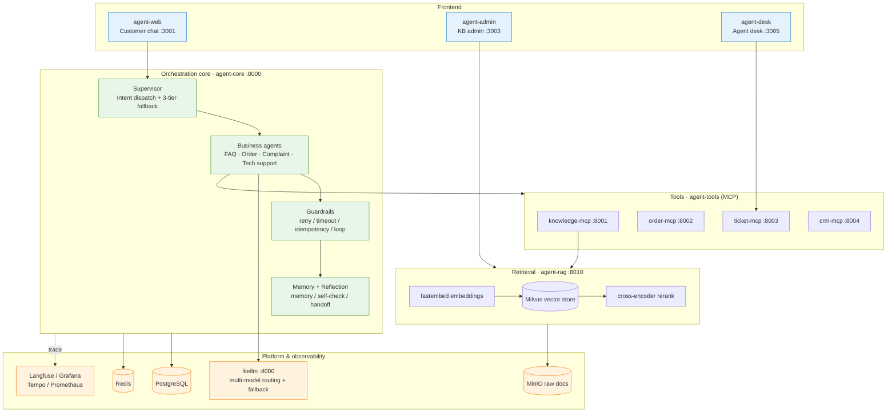

<div align="center">

# 🐎 Joysteed Agent Studio

**A production-grade, observable, and extensible multi-agent platform for AI customer service**

Built with LangGraph multi-agent orchestration · RAG retrieval · MCP tool calling · multi-model routing & fallback

[](LICENSE)
[](https://www.python.org/)
[](https://github.com/langchain-ai/langgraph)
[](https://docs.docker.com/compose/)

English · [简体中文](README.md)

</div>

---

## What is this

Joysteed Agent Studio is a **ready-to-run AI customer service system**: a customer asks a question on the web, a `supervisor` routes the request to the most suitable business agent (FAQ, orders, complaints, tech support), agents call MCP tools to look up orders / file tickets / read CRM and retrieve answers from a RAG knowledge base. When the AI can't resolve an issue, it **escalates to a human** agent desk automatically.

This is not a toy demo. It's an engineering reference that lands the hard parts all at once: **multi-agent orchestration, retrieval augmentation, tool governance, stability fallbacks, and end-to-end observability.**

<div align="center">
  
  <br/>
  <em>A single message carries multiple intents — the supervisor fans them out to different business agents that respond cooperatively</em>
</div>

### Why it's different

- **Multi-agent, not a monolithic prompt** — the supervisor handles intent dispatch; business agents are independent and support agent-to-agent handoff.
- **Stability is a first-class citizen** — three-tier fallback (retry → single-intent fallback → human handoff), idempotency, timeouts, loop protection, and MCP connection self-healing (auto-reconnect on stale sessions, no bad cache on tool-discovery failure) — not a bare `try/except`.
- **Agents as data** — adding a new business agent only takes an edit to `agents.yaml`, no Python changes required.
- **Least-privilege tool authorization** — MCP tools can be granted per `server:` group or per single `tool:`, with fine-grained control over sensitive operations (e.g. refunds).
- **A real RAG pipeline** — Milvus vector store + local fastembed embeddings + cross-encoder reranking, auto-degrading to RRF hybrid retrieval on failure.
- **End-to-end observability** — Langfuse traces LLM calls, OpenTelemetry → Tempo/Grafana for traces, Prometheus for metrics.

<div align="center">
  
  <br/>
  <em>Langfuse records every LLM call's input/output, token usage, latency, and cost — the full trace at a glance</em>
</div>

## ✨ Core Capabilities

| Capability | Description |
|---|---|
| 🧭 **Supervisor multi-agent orchestration** | Supervisor identifies intent and dispatches to FAQ / order / complaint / tech-support agents, with parallel fan-out for multi-intent requests |
| 🔁 **Three-tier fallback** | L1 retry → L2 single-intent fallback → L3 human handoff, so no failure is ever dumped on the customer |
| 🧩 **Agents as data** | `config/agents.yaml` declares each agent's model, prompt, tools, and handoff policy — zero code to add an agent |
| 🔐 **Least-privilege MCP tools** | Grant per `server:order` group or per single `tool:apply_refund`, with fine-grained control over sensitive ops |
| 📚 **Production-grade RAG** | Milvus vector retrieval + fastembed embeddings + cross-encoder reranking + high-confidence FAQ shortcut |
| 🪞 **Reflection & self-check** | Per-agent `self_check` / `judge` reflection strategy to reduce errors on high-risk replies |
| 🧠 **Layered memory** | Working memory + long-term memory + decay, preserving context across turns |
| 🎚️ **Multi-model routing** | litellm routes Haiku / Sonnet / Opus by task complexity, with automatic model-to-model fallback |
| 👀 **Full observability** | Langfuse (LLM tracing) + Grafana/Tempo (distributed traces) + Prometheus (metrics) |
| 👩‍💻 **Three front-ends** | Customer chat + knowledge-base admin + agent desk for human takeover |

## 🏗️ Architecture
```
┌───────────────────────────────────────────────────────────────────┐
│                      Web 前端 (React/Vue)                          │
│               POST 发消息 / SSE 接收流式回复                        │
└──────────────────────────────┬────────────────────────────────────┘
                               │ HTTP (REST + SSE)
┌──────────────────────────────▼────────────────────────────────────┐
│                       API 网关层 (FastAPI)                         │
│               鉴权 / 限流 / 会话管理 / SSE 推送                     │
└──────────────────────────────┬────────────────────────────────────┘
                               │
┌──────────────────────────────▼────────────────────────────────────┐
│  agent-core 主服务                                                 │
│                                                                   │
│  ┌─────────────────── Agent 编排层 (LangGraph) ─────────────────┐ │
│  │  Supervisor → FAQ Agent / Order Agent / Complaint Agent ...  │ │
│  └──────────────────────────┬───────────────────────────────────┘ │
│                             │                                     │
│  ┌─────────────────── Skill 层 ─────────────────────────────────┐ │
│  │  退款Skill / 投诉处理Skill / 故障诊断Skill / 查单Skill ...    │ │
│  │  编排多个 Tool 完成一个业务动作                                 │ │
│  └──────────────────────────┬───────────────────────────────────┘ │
│                             │                                     │
│  ┌─────────────────── MCP Client ───────────────────────────────┐ │
│  │  连接各 MCP Server，获取 Tool 列表，调用 Tool                  │ │
│  └──────────────────────────┬───────────────────────────────────┘ │
└──────────────────────────────┬────────────────────────────────────┘
                               │ MCP 协议 (Streamable HTTP)
┌──────────────────────────────▼────────────────────────────────────┐
│  agent-tools 工具服务（独立项目/独立部署）                           │
│                                                                   │
│  ┌──────────────┐ ┌──────────────┐ ┌──────────────┐ ┌──────────┐ │
│  │ 知识库 MCP   │ │ 订单 MCP     │ │ 工单 MCP     │ │ CRM MCP  │ │
│  │ Server       │ │ Server       │ │ Server       │ │ Server   │ │
│  │- search_faq  │ │- query_order │ │- create_ticket│ │- get_info│ │
│  │- search_docs │ │- apply_refund│ │- query_ticket│ │- update  │ │
│  └──────┬───────┘ └──────┬───────┘ └──────┬───────┘ └────┬─────┘ │
└─────────┼────────────────┼────────────────┼───────────────┼───────┘
          │                │                │               │
          ▼                ▼                ▼               ▼
     Milvus/RAG       订单系统 API      工单系统 API     CRM API

┌───────────────────────────────────────────────────────────────────┐
│                        LiteLLM Proxy                              │
│                  智能路由 / Fallback / 熔断                         │
│              Claude ←→ OpenAI ←→ DeepSeek                         │
└───────────────────────────────────────────────────────────────────┘

┌───────────────────────────────────────────────────────────────────┐
│                        数据层                                      │
│  ┌─────────────┐  ┌──────────────┐  ┌──────────────┐             │
│  │  Milvus     │  │ PostgreSQL   │  │    Redis     │             │
│  │ (向量检索)   │  │ (状态持久化)  │  │ (缓存/队列)   │             │
│  └─────────────┘  └──────────────┘  └──────────────┘             │
└───────────────────────────────────────────────────────────────────┘

┌───────────────────────────────────────────────────────────────────┐
│                        可观测性层                                   │
│  ┌──────────────┐  ┌──────────────┐  ┌──────────────┐            │
│  │ OpenTelemetry│  │   Langfuse   │  │   Grafana    │            │
│  │ (采集)       │  │ (LLM 链路)   │  │ (系统监控)    │            │
│  └──────────────┘  └──────────────┘  └──────────────┘            │
└───────────────────────────────────────────────────────────────────┘
```



**The journey of one request:** a customer asks in `agent-web` → the supervisor in `agent-core` identifies intent and dispatches to a business agent → the agent calls MCP tools (look up order / file ticket) and retrieves knowledge via `agent-rag` → litellm picks a suitable model to generate the reply → traces are reported to the observability stack throughout; if the AI can't resolve it, the case is escalated to `agent-desk` for a human agent.

## 📦 Modules

| Module | Stack | Responsibility |
|---|---|---|
| [agent-core](agent-core/) | Python · LangGraph | Supervisor orchestration, business agents, guardrails, memory & reflection |
| [agent-rag](agent-rag/) | Python · Milvus · fastembed | Knowledge retrieval: embedding, vector recall, reranking, raw-doc storage |
| [agent-tools](agent-tools/) | Python · MCP | 4 MCP servers: knowledge / order / ticket / crm |
| [agent-web](agent-web/) | TypeScript · Vite | Customer chat UI |
| [agent-admin](agent-admin/) | TypeScript · Vite | RAG knowledge-base admin console |
| [agent-desk](agent-desk/) | TypeScript · Vite | Agent desk: tickets, human takeover, outbound calls |

## 🚀 Quick Start

### Prerequisites

- **Docker + Docker Compose** (the only hard dependency). On Windows / macOS install [Docker Desktop](https://www.docker.com/products/docker-desktop/); on Linux install Docker Engine — all three ship with the `docker compose` command.
- An LLM API key — by default the project reaches Anthropic Claude via litellm (official key or a compatible proxy endpoint), but you can point [litellm_config.yaml](litellm_config.yaml) at any OpenAI / Anthropic-compatible model or proxy

### One command, full stack (recommended)

```bash
# 1. Configure keys
cp .env.example .env
# Edit .env and fill in your LLM API key (ANTHROPIC_API_KEY by default; for other providers see litellm_config.yaml)

# 2. Bring up the whole stack
docker compose up -d
```

> 💡 Mac / Linux users with `make` installed can use the shorter `make up` (equivalent to `docker compose up -d`), plus `make test` / `make lint` and other shortcuts — see `make help`. Windows has no `make` by default, so just use the `docker compose` command above.

> ⏱️ **About the first launch:** the first run pulls images, builds dependencies, and downloads the RAG embedding & reranking models (hundreds of MB) from a HuggingFace mirror — this takes a few minutes. **It's all cached afterwards, so every later `make up` starts in seconds.** For a quick evaluation, the one-command full stack is the easiest path.

Once up, open:

| Entry | URL | Description |
|---|---|---|
| 💬 Customer chat | http://localhost:3001 | agent-web |
| 🗂️ KB admin | http://localhost:3003 | agent-admin |
| 🎧 Agent desk | http://localhost:3005 | agent-desk |
| 🔌 Core API | http://localhost:8000 | agent-core |
| 📊 Langfuse | http://localhost:3000 | LLM call tracing |
| 📈 Grafana | http://localhost:3002 | trace / metrics dashboards |

```bash
docker compose down   # stop all services (or make down if you have make)
```

### Developing a single module

When working on one module, bring up dependencies with compose and run that module locally with hot reload for faster iteration. The shortcuts below require `make` (Windows users can read the underlying commands directly in the [Makefile](Makefile)):

```bash
make install     # install per-module deps (uv + npm)
make test        # run agent-core / agent-rag tests
make lint        # ruff checks
```

See `make help` for more commands.

## ⚙️ Configuration

### Add a business agent (zero code)

Edit [agent-core/config/agents.yaml](agent-core/config/agents.yaml) and add a block:

```yaml
agents:
  refund:                          # new agent name
    prompt_id: agents/refund_system
    model_key: model_main
    tools:
      - tool:apply_refund          # fine-grained: only this sensitive tool
      - server:order               # or grant the whole order server
    can_handoff_to: [complaint]    # which agents it can hand off to
    reflection: judge              # reflection strategy: off / self_check / judge
```

### Multi-model routing

In [litellm_config.yaml](litellm_config.yaml), map models by task complexity with automatic fallback: Haiku (FAQ / simple queries) → Sonnet (orders / tech support) → Opus (complex complaints).

## 📖 Design Docs

Full architecture and design docs live in [docs/](docs/):

- [technical-design.md](docs/technical-design.md) — overall technical design & orchestration
- [rag-knowledge-base.md](docs/rag-knowledge-base.md) — RAG knowledge-base design
- [stability-engineering.md](docs/stability-engineering.md) — stability & fallback engineering
- [security-design.md](docs/security-design.md) — security design
- [high-concurrency-scaling.md](docs/high-concurrency-scaling.md) — high-concurrency scaling

## 🤝 Contributing

Issues and PRs are welcome. Please run `make test` and `make lint` before submitting.

## 📄 License

[MIT](LICENSE)

