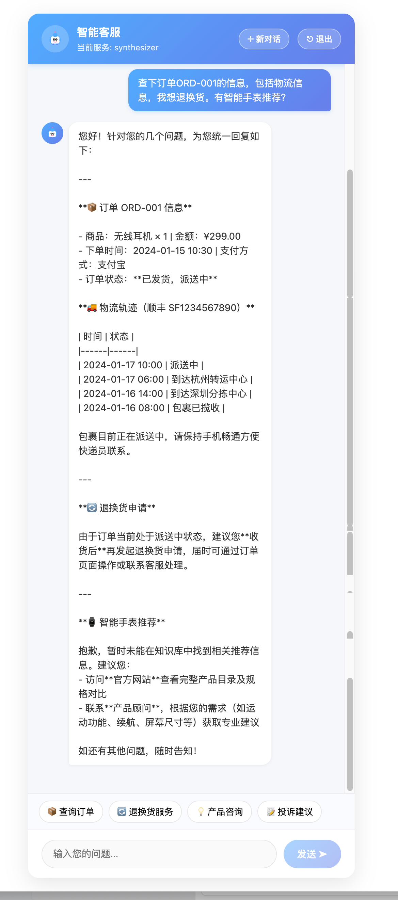
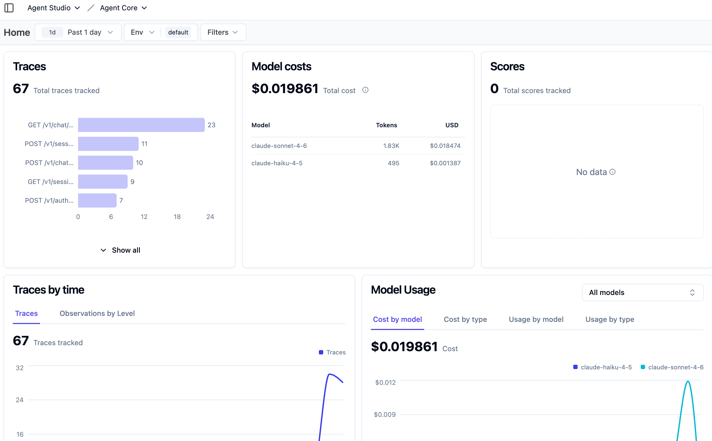
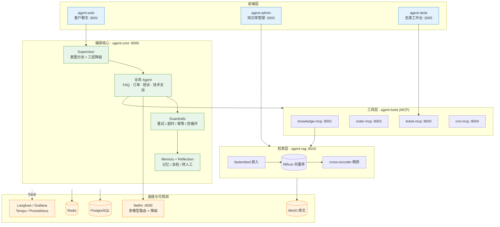

<div align="center">

# 🐎 Joysteed Agent Studio

**一套生产级、可观测、可扩展的多 Agent 智能客服平台**

基于 LangGraph 多智能体编排 · RAG 知识检索 · MCP 工具调用 · 多模型路由与降级

[](LICENSE)
[](https://www.python.org/)
[](https://github.com/langchain-ai/langgraph)
[](https://docs.docker.com/compose/)

[English](README.en.md) · 简体中文

</div>

---

## 这是什么

Joysteed Agent Studio 是一个**开箱即用的智能客服系统**:客户在网页上提问,平台用一个「主管(supervisor)」把请求分派给最合适的业务 Agent(FAQ、订单、投诉、技术支持),Agent 通过 MCP 工具查订单 / 建工单 / 读 CRM,并从 RAG 知识库检索答案;当 AI 无法解决时,自动**转人工**到坐席工作台。

它不是一个玩具 demo,而是把**多 Agent 编排、检索增强、工具治理、稳定性兜底、全链路可观测**这几件难事一次性落地的工程参考。

<div align="center">
  
  <br/>
  <em>客户一句话包含多个意图,Supervisor 并行分派给不同业务 Agent 协同应答</em>
</div>

### 为什么不一样

- **多 Agent 而非单体 Prompt** —— supervisor 做意图分派,业务 Agent 各自独立,支持 Agent 间转交(handoff)。
- **稳定性是一等公民** —— 三层降级(重试 → 单意图回退 → 转人工)、幂等、超时、防循环、MCP 连接自愈(会话失效自动重连、工具发现失败不落坏缓存),而不是裸 `try/except`。
- **Agent 即配置(agents-as-data)** —— 新增一个业务 Agent 只需改 `agents.yaml`,无需动任何 Python 代码。
- **工具按最小权限授权** —— MCP 工具可按 `server:` 整组或 `tool:` 单个粒度授权,敏感操作(如退款)细粒度控制。
- **真实 RAG 链路** —— Milvus 向量库 + 本地 fastembed 嵌入 + cross-encoder 精排,异常自动降级回 RRF 混合检索。
- **全链路可观测** —— Langfuse 追踪 LLM 调用,OpenTelemetry → Tempo/Grafana 看 trace,Prometheus 看指标。

<div align="center">
  
  <br/>
  <em>Langfuse 记录每次 LLM 调用的输入输出、token 消耗、延迟与成本,链路一目了然</em>
</div>

## ✨ 核心能力

| 能力 | 说明 |
|---|---|
| 🧭 **Supervisor 多 Agent 编排** | 主管节点识别意图并分派给 FAQ / 订单 / 投诉 / 技术支持 Agent,支持多意图并行扇出 |
| 🔁 **三层降级兜底** | L1 重试 → L2 单意图回退 → L3 转人工,任意层失败都不会把错误甩给客户 |
| 🧩 **Agent 即配置** | `config/agents.yaml` 声明 Agent 的模型、Prompt、工具、转交策略,新增 Agent 零改代码 |
| 🔐 **MCP 工具最小权限** | 按 `server:order` 整组或 `tool:apply_refund` 单个授权,敏感操作细粒度管控 |
| 📚 **生产级 RAG** | Milvus 向量检索 + fastembed 嵌入 + cross-encoder 精排 + FAQ 高置信短路 |
| 🪞 **反思与自检** | 按 Agent 配置 `self_check` / `judge` 反思策略,降低高风险回复的出错率 |
| 🧠 **分层记忆** | 工作记忆 + 长期记忆 + 衰减机制,跨轮次保持上下文 |
| 🎚️ **多模型路由** | litellm 按任务复杂度路由 Haiku / Sonnet / Opus,并配置模型间自动 fallback |
| 👀 **全链路可观测** | Langfuse(LLM 追踪)+ Grafana/Tempo(分布式 trace)+ Prometheus(指标) |
| 👩‍💻 **三端齐全** | 客户聊天端 + 知识库管理后台 + 坐席人工接管工作台 |

## 🏗️ 系统架构



**一次客户请求的旅程:** 客户在 `agent-web` 提问 → `agent-core` 的 Supervisor 识别意图分派给业务 Agent → Agent 调用 MCP 工具(查订单 / 建工单)并经 `agent-rag` 检索知识 → litellm 选择合适模型生成回复 → 全程 trace 上报可观测平台;若 AI 无法解决,转人工到 `agent-desk` 由坐席接管。

## 📦 模块一览

| 模块 | 技术栈 | 职责 |
|---|---|---|
| [agent-core](agent-core/) | Python · LangGraph | Supervisor 编排、业务 Agent、guardrails、记忆与反思 |
| [agent-rag](agent-rag/) | Python · Milvus · fastembed | 知识库检索:嵌入、向量召回、精排、原文存储 |
| [agent-tools](agent-tools/) | Python · MCP | 4 个 MCP server:knowledge / order / ticket / crm |
| [agent-web](agent-web/) | TypeScript · Vite | 客户端聊天界面 |
| [agent-admin](agent-admin/) | TypeScript · Vite | RAG 知识库管理后台 |
| [agent-desk](agent-desk/) | TypeScript · Vite | 坐席工作台:工单、人工接管、外呼 |

## 🚀 快速开始

### 前置要求

- **Docker + Docker Compose**(唯一硬依赖)。Windows / macOS 装 [Docker Desktop](https://www.docker.com/products/docker-desktop/),Linux 装 Docker Engine 即可——三者都内置了 `docker compose` 命令。
- 一个大模型 API Key —— 项目默认通过 litellm 接入 Anthropic Claude(可用官方 Key 或兼容的中转地址),也可在 [litellm_config.yaml](litellm_config.yaml) 换成任意 OpenAI / Anthropic 兼容的模型或中转

### 一键启动全栈(推荐)

```bash
# 1. 配置密钥
cp .env.example .env
# 编辑 .env,填入大模型 API Key(默认用 ANTHROPIC_API_KEY;换其它 provider 见 litellm_config.yaml)

# 2. 一键起全栈
docker compose up -d
```

> 💡 Mac / Linux 用户若已安装 `make`,可用更短的 `make up`(等价于 `docker compose up -d`),以及 `make test` / `make lint` 等快捷命令,详见 `make help`。Windows 默认无 `make`,直接用上面的 `docker compose` 命令即可。

> ⏱️ **关于首次启动:** 第一次会拉取镜像、构建依赖,并从 HuggingFace 国内镜像下载 RAG 的嵌入与精排模型(数百 MB),需要几分钟。**这些都会被缓存,之后每次 `make up` 都是秒级启动。** 想快速评估项目,全栈一键起最省心。

启动后访问:

| 入口 | 地址 | 说明 |
|---|---|---|
| 💬 客户聊天 | http://localhost:3001 | agent-web |
| 🗂️ 知识库管理 | http://localhost:3003 | agent-admin |
| 🎧 坐席工作台 | http://localhost:3005 | agent-desk |
| 🔌 Core API | http://localhost:8000 | agent-core |
| 📊 Langfuse | http://localhost:3000 | LLM 调用追踪 |
| 📈 Grafana | http://localhost:3002 | trace / 指标看板 |

```bash
docker compose down   # 停止全部服务(有 make 也可用 make down)
```

### 仅开发某个模块

改单个模块时,用 compose 起依赖、本地热重载跑该模块,迭代更快。以下快捷命令需要 `make`(Windows 用户可直接查看 [Makefile](Makefile) 里对应的原始命令):

```bash
make install     # 安装各模块依赖(uv + npm)
make test        # 运行 agent-core / agent-rag 测试
make lint        # ruff 检查
```

更多命令见 `make help`。

## ⚙️ 配置说明

### 新增一个业务 Agent(零改代码)

编辑 [agent-core/config/agents.yaml](agent-core/config/agents.yaml),加一段即可:

```yaml
agents:
  refund:                          # 新 Agent 名
    prompt_id: agents/refund_system
    model_key: model_main
    tools:
      - tool:apply_refund          # 细粒度:只授权这一个敏感工具
      - server:order               # 或整组授权 order server 全部工具
    can_handoff_to: [complaint]    # 可转交给哪些 Agent
    reflection: judge              # 反思策略:off / self_check / judge
```

### 多模型路由

在 [litellm_config.yaml](litellm_config.yaml) 中按任务复杂度映射模型,并配置自动降级:Haiku(FAQ/简单查询)→ Sonnet(订单/技术支持)→ Opus(复杂投诉)。

## 📖 设计文档

完整的架构与设计文档在 [docs/](docs/):

- [technical-design.md](docs/technical-design.md) — 总体技术设计与编排层
- [rag-knowledge-base.md](docs/rag-knowledge-base.md) — RAG 知识库设计
- [stability-engineering.md](docs/stability-engineering.md) — 稳定性与降级工程
- [security-design.md](docs/security-design.md) — 安全设计
- [high-concurrency-scaling.md](docs/high-concurrency-scaling.md) — 高并发扩展

## 🤝 贡献

欢迎 Issue 与 PR。提交前请运行 `make test` 与 `make lint`。

## 📄 License

[MIT](LICENSE)

