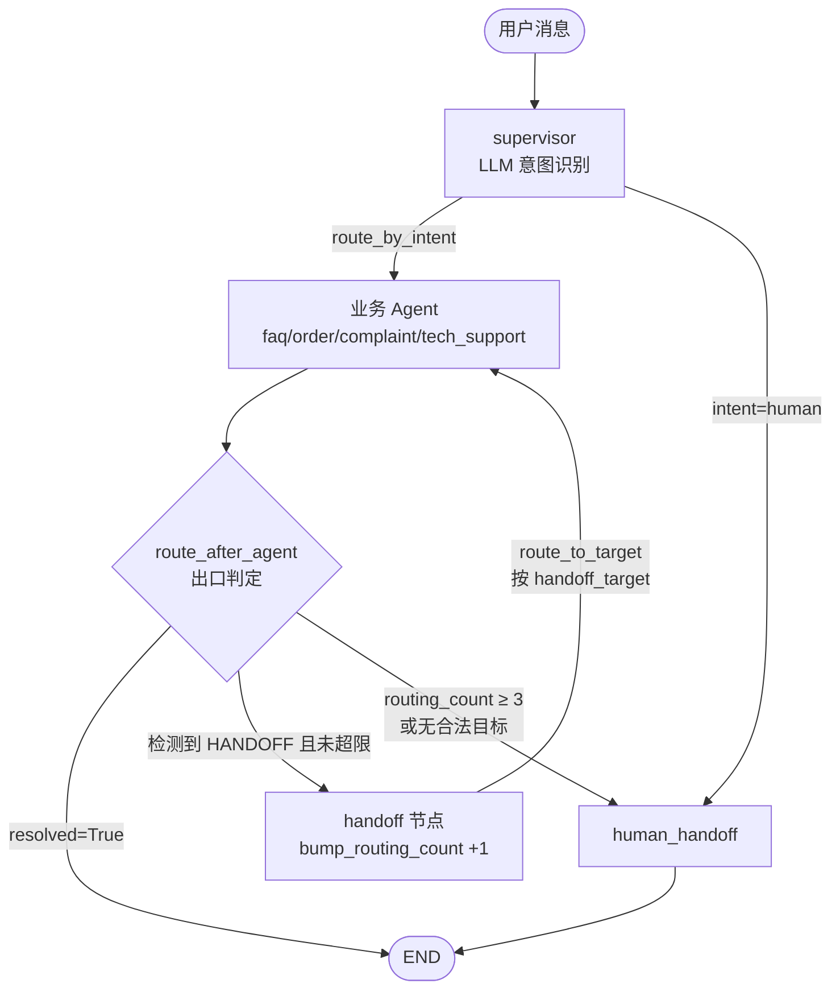
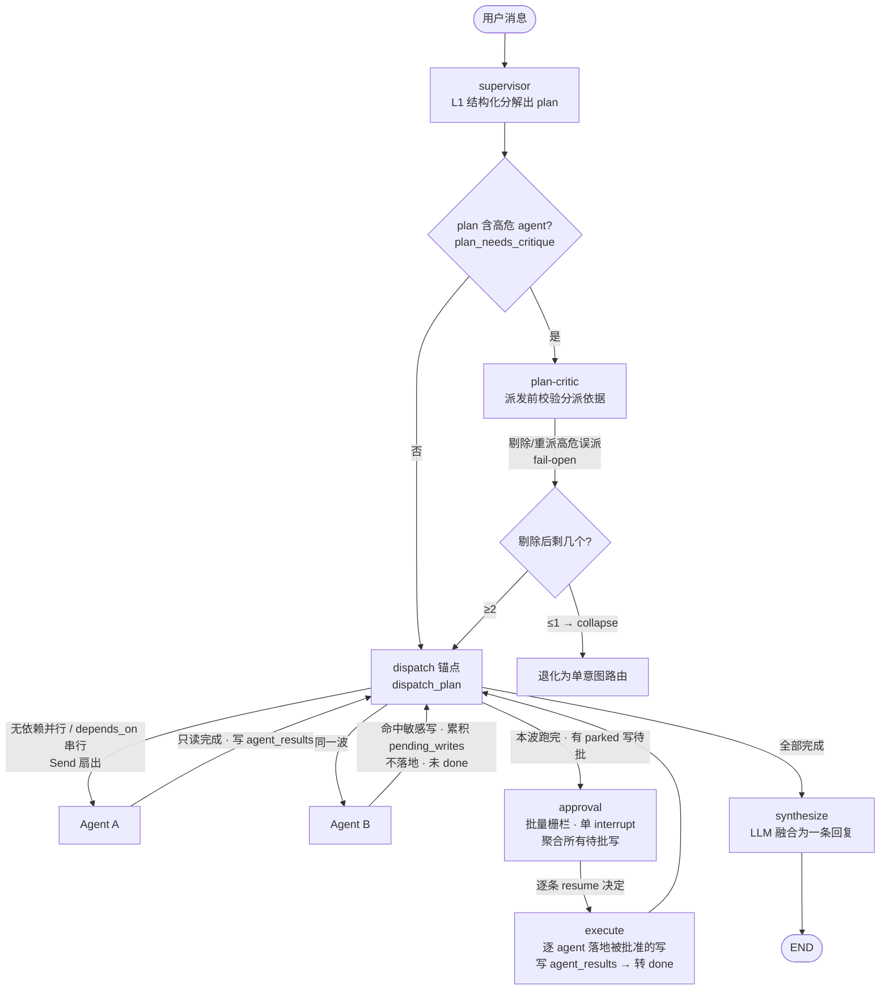
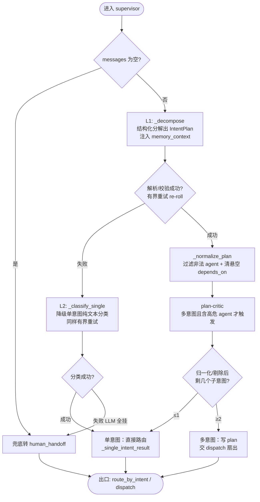

# 智能客服助手 — 多 Agent 系统技术方案

## 一、项目概述

基于 LangGraph 构建的多 Agent 智能客服系统，支持多轮对话、多模型智能路由、人工审批流程，面向 Web 端部署，目标 QPS 1000+。

### 多项目架构

采用 **Monorepo** 管理（开源项目名：`agent-studio`），包含四个子项目：

| 子项目 | 职责 | 说明 |
|--------|------|------|
| **agent-core** | Agent 编排 + Skill + API 服务 | 主服务，包含 LangGraph 编排、Skill 业务流程、对外 API |
| **agent-tools** | MCP Server 工具服务 | 独立服务，通过 MCP 协议暴露 Tools 给 Agent 调用 |
| **agent-rag** | RAG 知识库服务 | 独立服务，文档管理后台 + 检索引擎|
| **agent-web** | 前端应用 | 客户聊天 UI + 人工坐席工作台|

**一键启动：** 用户只需 Docker + 1 个 LLM API Key，`make up` 即可全栈运行。

---

## 二、系统架构

```
┌───────────────────────────────────────────────────────────────────┐
│                      Web 前端 (React/Vue)                          │
│               POST 发消息 / SSE 接收流式回复                        │
└──────────────────────────────┬────────────────────────────────────┘
                               │ HTTP (REST + SSE)
┌──────────────────────────────▼────────────────────────────────────┐
│                       API 网关层 (FastAPI)                         │
│               鉴权 / 限流 / 会话管理 / SSE 推送                     │
└──────────────────────────────┬────────────────────────────────────┘
                               │
┌──────────────────────────────▼────────────────────────────────────┐
│  agent-core 主服务                                                 │
│                                                                   │
│  ┌─────────────────── Agent 编排层 (LangGraph) ─────────────────┐ │
│  │  Supervisor → FAQ Agent / Order Agent / Complaint Agent ...  │ │
│  └──────────────────────────┬───────────────────────────────────┘ │
│                             │                                     │
│  ┌─────────────────── Skill 层 ─────────────────────────────────┐ │
│  │  退款Skill / 投诉处理Skill / 故障诊断Skill / 查单Skill ...    │ │
│  │  编排多个 Tool 完成一个业务动作                                 │ │
│  └──────────────────────────┬───────────────────────────────────┘ │
│                             │                                     │
│  ┌─────────────────── MCP Client ───────────────────────────────┐ │
│  │  连接各 MCP Server，获取 Tool 列表，调用 Tool                  │ │
│  └──────────────────────────┬───────────────────────────────────┘ │
└──────────────────────────────┬────────────────────────────────────┘
                               │ MCP 协议 (Streamable HTTP)
┌──────────────────────────────▼────────────────────────────────────┐
│  agent-tools 工具服务（独立项目/独立部署）                           │
│                                                                   │
│  ┌──────────────┐ ┌──────────────┐ ┌──────────────┐ ┌──────────┐ │
│  │ 知识库 MCP   │ │ 订单 MCP     │ │ 工单 MCP     │ │ CRM MCP  │ │
│  │ Server       │ │ Server       │ │ Server       │ │ Server   │ │
│  │- search_faq  │ │- query_order │ │- create_ticket│ │- get_info│ │
│  │- search_docs │ │- apply_refund│ │- query_ticket│ │- update  │ │
│  └──────┬───────┘ └──────┬───────┘ └──────┬───────┘ └────┬─────┘ │
└─────────┼────────────────┼────────────────┼───────────────┼───────┘
          │                │                │               │
          ▼                ▼                ▼               ▼
     Milvus/RAG       订单系统 API      工单系统 API     CRM API

┌───────────────────────────────────────────────────────────────────┐
│                        LiteLLM Proxy                              │
│                  智能路由 / Fallback / 熔断                         │
│              Claude ←→ OpenAI ←→ DeepSeek                         │
└───────────────────────────────────────────────────────────────────┘

┌───────────────────────────────────────────────────────────────────┐
│                        数据层                                      │
│  ┌─────────────┐  ┌──────────────┐  ┌──────────────┐             │
│  │  Milvus     │  │ PostgreSQL   │  │    Redis     │             │
│  │ (向量检索)   │  │ (状态持久化)  │  │ (缓存/队列)   │             │
│  └─────────────┘  └──────────────┘  └──────────────┘             │
└───────────────────────────────────────────────────────────────────┘

┌───────────────────────────────────────────────────────────────────┐
│                        可观测性层                                   │
│  ┌──────────────┐  ┌──────────────┐  ┌──────────────┐            │
│  │ OpenTelemetry│  │   Langfuse   │  │   Grafana    │            │
│  │ (采集)       │  │ (LLM 链路)   │  │ (系统监控)    │            │
│  └──────────────┘  └──────────────┘  └──────────────┘            │
└───────────────────────────────────────────────────────────────────┘
```

---

## 三、技术栈清单

### 3.1 核心框架

| 组件 | 选型 | 用途 |
|------|------|------|
| 开发语言 | Python 3.11+ | 主语言 |
| Agent 编排 | LangGraph >=0.4 | 多 Agent 状态机编排 |
| 基础组件 | LangChain Core >=0.3 | Tools / Prompts / Output Parsers |
| LLM 集成 | langchain-openai | 通过 LiteLLM Proxy 统一接入 |
| MCP 集成 | langchain-mcp-adapters | Agent 通过 MCP 协议调用 Tools |
| API 服务 | FastAPI + Uvicorn | 异步 HTTP 服务 |
| 实时通信 | SSE (Server-Sent Events) | 流式输出 |
| MCP Server 框架 | FastMCP (mcp sdk) | 工具服务实现 |

### 3.2 多模型网关

| 组件 | 选型 | 用途 |
|------|------|------|
| 模型网关 | LiteLLM Proxy | 统一接口、路由、Fallback、熔断 |
| 主力模型 | Claude Sonnet | 订单/技术支持等常规对话 |
| 快速模型 | Claude Haiku | FAQ 等简单问题 |
| 强力模型 | Claude Opus | 复杂投诉、情绪安抚 |
| Fallback | OpenAI GPT-4o / DeepSeek | 主模型不可用时兜底 |

### 3.3 数据存储

| 组件 | 选型 | 用途 |
|------|------|------|
| 向量数据库 | Milvus | RAG 语义/稀疏向量检索（collection-per-kb，dense + BM25 稀疏，库内 RRF 融合） |
| 关系数据库 | PostgreSQL | 业务数据、RAG 元数据、对话历史、审批 checkpoint |
| 缓存 | Redis | 会话缓存、热点 FAQ、限流 |
| 消息队列 | Redis Streams | 削峰填谷 |

### 3.4 知识库 (RAG)

| 组件 | 选型 | 用途 |
|------|------|------|
| Embedding | text-embedding-3-small (云) / BGE (自部署 GPU) | 文档向量化 |
| 文档解析 | Unstructured | 多格式文件解析（PDF/Word/PPT/HTML/MD） |
| 文本分块 | LangChain Text Splitters + 自定义策略 | 递归/语义/标题层级分块 |
| 向量检索 | Milvus | 语义检索 |
| 全文检索 | Elasticsearch | BM25 关键词检索 |
| 重排序 | BGE-Reranker / Cohere Rerank | Cross-Encoder 精排 |
| 对象存储 | MinIO / S3 | 原始文件存储 |
| 数据来源 | 产品文档、历史工单、FAQ 文档 | 知识库内容 |
| 独立服务 | **agent-rag** | 独立部署 |

### 3.5 可观测性

| 组件 | 选型 | 职责 |
|------|------|------|
| 采集层 | OpenTelemetry SDK + Collector | 统一采集 traces / metrics / logs |
| LLM 监控 | Langfuse (自托管) | LLM 调用链路、token 成本、Agent 流程可视化 |
| 系统监控 | Prometheus + Grafana | QPS、P99 延迟、CPU/内存、告警 |
| 分布式追踪 | Tempo / Jaeger | traces 存储和查询 |

### 3.6 工程基础设施

| 组件 | 选型 | 用途 |
|------|------|------|
| 包管理 | uv | 依赖管理和虚拟环境 |
| 配置管理 | pydantic-settings + .env | 类型安全配置 |
| 日志 | structlog | 结构化日志 |
| 测试 | pytest + pytest-asyncio | 单元测试和集成测试 |
| 容器化 | Docker + Docker Compose | 开发和部署 |
| 类型检查 | mypy / pyright | 类型安全 |

---

## 四、Agent 执行模式设计

### 4.1 设计决策

采用 **Tool Calling Loop** 作为 Agent 执行骨架，结合 **Skill SubGraph** 固化复杂流程，而非让 LLM 每次自行规划。

**核心精髓：把"计划"固化到 Skill SubGraph 里，而不是让 LLM 每次自己规划。**

### 4.2 分层执行策略

```
┌─ Supervisor: 纯 LLM 判断（不需要工具，单意图路由 / 多意图承担 Orchestrator 职能，见 4.7.0）
│
├─ 简单 Agent (FAQ / Human Handoff):
│    Tool Calling Loop
│    LLM → 调用 Tool → 拿结果 → 回复
│    （1-2 轮就结束）
│
└─ 复杂 Agent (Order / Complaint / Tech):
     Tool Calling Loop + SubGraph Skill
     LLM → 选择 Skill → Skill 内部按图编排多步 Tool 调用
     （复杂流程由 Skill SubGraph 保证步骤正确）
```

### 4.3 为什么选 Tool Calling Loop 而非经典 ReAct

| 对比项 | 经典 ReAct（文本解析式） | Tool Calling Loop（模型原生） |
|--------|------------------------|------------------------------|
| 工具调用方式 | prompt 约束 + 正则解析文本 | 模型原生 function calling API |
| Thought（思考链） | 显式输出，消耗额外 token | 内化在模型推理中 |
| 格式可靠性 | 依赖 LLM 遵守文本格式，易出错 | 结构化 JSON，格式保证正确 |
| 适用模型 | 所有 LLM | Claude / GPT-4o / DeepSeek 等 |
| 性能 | Thought 文本消耗 token | 无额外开销 |

选择 Tool Calling Loop 原因：
1. 现代模型（Claude / GPT-4o / DeepSeek）原生支持，格式可靠
2. 不浪费 token 在显式 Thought 输出上
3. LangGraph `create_react_agent` 底层已是 Tool Calling Loop

### 4.4 执行循环伪代码

```python
# Tool Calling Loop 核心逻辑（LangGraph 内部实现）
while True:
    response = await llm.ainvoke(messages, tools=available_tools)

    if response.tool_calls:
        for tool_call in response.tool_calls:
            result = await execute_tool(tool_call)
            messages.append(ToolMessage(content=result, tool_call_id=tool_call.id))
    else:
        break  # 无工具调用 → 循环结束 → 输出最终回复
```

### 4.5 为什么复杂流程用 Skill SubGraph 而非 LLM 自行规划

| 方案 | 做法 | 风险 |
|------|------|------|
| LLM 自行规划 | 把 15 个 Tool 全给 LLM，让它自己决定调用顺序 | 不可控，可能跳过校验直接退款 |
| **Skill SubGraph** | 把"退款必须先查单→再校验→再申请"固化为图 | 流程正确性由代码保证，不依赖 LLM |

**好处：**
- 简单场景：Tool Calling 1-2 轮搞定，快
- 复杂场景：Skill 保证流程正确（退款必须先校验再申请），不依赖 LLM 规划能力
- LLM 只负责"选择哪个 Skill"，不负责"Skill 内部怎么执行"
- 关键业务流程可审计、可测试、可复现

### 4.6 多 Agent 通信方案与 A2A 扩展预留

#### 当前方案：进程内通信（LangGraph 共享 State）

当前所有 Agent 在同一个 LangGraph Graph 内，通过共享 State + 条件边实现通信：

```
Supervisor → (条件边) → Order Agent → (哑路由) → END / 交接目标 / Human Handoff
                所有 Agent 共享 CustomerState，零网络开销
```

**选择理由：**
- Agent 数量少（5-6 个），无性能瓶颈
- 同一技术栈（Python），同一团队维护
- 进程内通信延迟为零，调试简单
- LangGraph 原生支持此模式

#### 何时需要 A2A 协议

| 触发条件 | 说明 |
|----------|------|
| Agent 数量 > 10 | 单 Graph 复杂度过高 |
| Agent 需独立扩缩容 | 投诉高峰需单独加投诉 Agent 实例 |
| 多团队/多语言开发 | 不同 Agent 由不同团队用不同语言实现 |
| 跨系统 Agent 协作 | 需要调用公司内其他系统的 Agent |
| 异步长时任务 | 某个 Agent 执行 5 分钟以上 |

#### 预留设计：接口抽象

不改当前实现，通过接口抽象预留未来迁移到 A2A 的能力：

预留的关键是两层抽象,当前实现与未来远程实现共用同一接口:

```python
class AgentInterface(Protocol):
    """Agent 统一接口 — 进程内/远程调用接口一致"""
    async def invoke(self, state: CustomerState) -> CustomerState: ...
    @property
    def agent_card(self) -> AgentCard: ...

class AgentCard(BaseModel):
    """Agent 能力卡片（预留 A2A Agent Card 概念）"""
    name: str
    description: str
    skills: list[str]
    input_schema: dict
    output_schema: dict
    endpoint: str | None = None  # 远程 Agent 时填 URL
```

- **`AgentInterface`** 统一"进程内调用"与"远程调用"的接口,业务代码只依赖它;
- **`AgentCard`** 是能力卡片(对齐 A2A 的 Agent Card 概念),`endpoint` 为空即进程内、有值即远程;
- **`AgentTransport`** 是通信层抽象,`LocalTransport` 当前直接调 LangGraph 节点(零网络开销),未来的 `RemoteTransport` 则按 registry 查到的 endpoint 发 HTTP/A2A 请求——两者接口一致,迁移时只换 transport 实现,Agent 业务代码不动。

#### 迁移路径

```
当前（P0-P3）                    未来（需要时）
─────────────                   ────────────
进程内 LangGraph Graph    →     部分 Agent 独立部署为服务
共享 State 通信           →     A2A 协议 / HTTP 通信
LocalTransport            →     RemoteTransport
全部一起扩容              →     按 Agent 独立扩缩容
```

迁移时只需：
1. 目标 Agent 部署为独立服务（暴露 `/invoke` 接口）
2. 注册到 Agent Registry
3. Supervisor 的 `LocalTransport` 替换为 `RemoteTransport`
4. Agent 业务代码不用改

### 4.7 编排选型权衡

本系统在「控制流由谁决定」这条轴上的定位，是刻意选择，非默认。记录权衡以免后续被反复质疑。

#### 4.7.1 控制流光谱与本系统定位

| 方案 | 控制流 | 代表 | 适用 | 本系统取舍 |
|------|--------|------|------|-----------|
| 全自主单 Loop | LLM 每步自主决定 | Claude Code、Hermes Agent | 判错可见/可逆/低成本（编码、个人助理） | ✗ 退款不可逆，不采用 |
| 全声明式编排 | 框架隐式编排 | CrewAI（YAML role/goal） | 快速原型，非工程人员可改 | ✗ obscures control flow，丢审批可见性 |
| 中央 supervisor 重判 | 每次回 supervisor 重分类 | — | — | ✗ 重判失忆 + 多一次 LLM，几乎无人作主路径 |
| 纯 Swarm 点对点交接 | Agent 自主定交接目标 | OpenAI handoff、LangGraph swarm | 独立子任务、延迟敏感 | △ 仅用于子域内（多意图会逐段丢） |
| 纯 Supervisor 编排 | 中央分解 + 派发 + 汇总 | LangGraph supervisor | 多意图、需可靠分解 | △ 顶层采用，但单意图不付其成本 |
| **混合：Supervisor 顶层 + Swarm 子域** | 顶层中央分解，子域内点对点 | **2026 production 共识** | 判错有代价 + 多意图 + 需护栏 | ✓ **本系统** |

#### 4.7.2 核心判断

- **带审批的客服 = 判错不可逆、有合规后果的域。** 要的是结构性保证（退款必过审批节点，图上没有别的边），而非靠 prompt 压住 LLM 的概率性正确。这是选显式图而非单 Loop 的根本原因。
- **单/多意图分层，不全局二选一。** 多意图需要可靠分解，是中央 Supervisor 的专职；纯 Swarm 串行交接靠每个 Agent 自觉识别「还有没处理的部分」，是分散的概率判断，会逐段丢意图。故顶层 Supervisor 分流单/多意图，子域内保留 Swarm 点对点交接以省去每跳 round-trip。
- **审批护栏与控制流选型正交。** 审批挂在工具/节点层（6.3 的 `interrupt`），单 Loop 和多 Agent 都能加；真正的分歧只在控制流是否交给 LLM 自主。
- **确定性骨架，LLM 只在决策点。** 分波派发（`dispatch_plan`）、哑路由出口均为纯代码，LLM 只在「分解 / Agent 执行 / 汇总」三处调用，避免编排本身也判错。
- **编排是多 Agent 最大失败源。** 故 handoff / 子意图派发做成**幂等**（`merge_results` 按 Agent 名覆盖，重试不重复退款/建单），状态走 LangGraph checkpoint（PG），不堆在 message 里。
- **数据化（6.2）改的是表达方式，不是架构。** 专业化分工（专属 prompt / 分级模型 / 可强制护栏）保留；消除的只是硬编码 node + 手工边的克隆成本。`agents-as-data` 落地于 LangGraph，同时保留显式控制流。

#### 4.7.3 不做什么

- 不引入全自主单 Loop 替代分级 Agent（丢专业化 + 护栏不可控）。
- 不迁移到 CrewAI 等全声明式框架（省了加 Agent，丢了控制流/审批可见性）。
- 不让单意图请求走分解/汇总（无谓的两次额外 LLM）——单/多意图分流，单意图走直接路由。
- 不把 prompt 内容、护栏边数据化——prompt 是不可压缩的领域知识，护栏是结构，二者留在显式层。
- 不让 LLM 驱动编排控制流——分波派发与出口路由保持确定性。

---

## 五、Agent 分工设计

### 5.1 Agent 职责

| Agent | 职责 | 模型 | Skill |
|-------|------|------|-------|
| Supervisor | 单/多意图判断 + 多意图分解编排 + 路由分发 | Sonnet | 无（纯 LLM 判断） |
| FAQ Agent | 常见问题解答 | Haiku | 知识检索 Skill |
| Order Agent | 订单查询/修改/退款/物流 | Sonnet | 查单 Skill、退款 Skill、催物流 Skill、修改订单 Skill |
| Complaint Agent | 投诉处理、情绪安抚、创建工单 | Opus | 投诉处理 Skill、赔偿申请 Skill |
| Tech Support Agent | 产品故障排查、技术问题 | Sonnet | 故障诊断 Skill、使用指引 Skill |
| Human Handoff Agent | 转接人工坐席 | Haiku | 转人工 Skill |

### 5.2 状态流转

```
用户输入 → Supervisor(判断单/多意图)
              │
   ┌──────────┴───────────────────────────────────┐
   │ 单意图                                  多意图 │
   ▼                                                ▼
 路由到专家 Agent                        分解为子意图计划 [order, complaint, faq]
   │                                                │
   ├─ faq        → FAQ Agent ─────┐      ┌──────────▼──────────┐
   ├─ order      → Order Agent ───┤      │  dispatch_plan      │ ← 确定性编排（不调 LLM）
   ├─ complaint  → Complaint Agent┤      │  无依赖并行/有依赖串行│
   ├─ tech       → Tech Agent ────┤      └─┬────────────────┬──┘
   │                              │   未完成│              完成│
   │                  ┌───────────▼──┐    ▼                  ▼
   │                  │route_after_  │  专家 Agent        Synthesizer
   │                  │agent(哑路由)  │  (结果写回 state)  (一次 LLM 融合)
   │                  └─┬────┬─────┬─┘    │                  │
   │           resolved │handoff│capped   └──回 dispatch 评估  ▼
   │                    ▼    ▼     ▼          下一波           END
   │                   END 目标  Human
   │                       Agent Handoff
   │
   └─ human → Human Handoff Agent → END
```

**两条路径：** 单意图走原直接路由 + 哑路由出口（零额外成本）；多意图经 Supervisor 分解 → `dispatch_plan` 分波执行（独立子意图并行、有依赖串行）→ Synthesizer 融合为连贯回复。子域内紧密相关的 Agent 仍可点对点交接（Level 2）。退款审批（6.3）拦截敏感写：单意图在 agent 出口进 approval，多意图并行时以批量栅栏收敛到单个 approval——两条都在写落地前拦截，Synthesizer 只融合已过护栏的结果。

---

## 六、核心模块设计

### 6.1 共享状态 (State)

```python
from typing import Annotated
from typing_extensions import TypedDict
from langgraph.graph.message import add_messages

class CustomerState(TypedDict):
    messages: Annotated[list, add_messages]
    intent: str | None
    customer_id: str
    customer_info: dict | None
    current_agent: str
    needs_approval: bool
    approval_result: str | None
    resolved: bool
    handoff_target: str | None    # 会话内点对点交接目标（由发起 Agent 写入）
    routing_count: int            # 交接跳数，哑路由据此封顶防死循环
    failure_count: int            # 连续失败计数，触发兜底转人工
    # —— 多意图编排（orchestrator）相关 ——
    plan: list[dict] | None       # supervisor 分解出的子意图计划，见 6.2.5
    agent_results: Annotated[dict, merge_results]  # 各 Agent 子结果汇集，供汇总节点融合
    is_multi_intent: bool         # supervisor 判定的单/多意图标志
    # —— 写操作审批闸（Layer 2）相关 ——
    pending_write: dict | None    # 单意图待批写：{agent, pending_calls, working_messages}
    pending_writes: Annotated[dict, merge_results]  # 多意图批量栅栏：{agent: {pending_calls, working_messages}}，见 6.3
    approval_decision: dict | bool | None  # 批量栅栏 resume 的逐条决定，透传给 execute
```

> 相比早期版本新增 `handoff_target`、`plan`、`agent_results`、`is_multi_intent`，并启用了原本预留但未接线的 `routing_count` / `failure_count`。`agent_results` 用自定义 reducer `merge_results`（按 agent 名归并、幂等覆盖）累积各子意图的产出，供汇总节点（6.2.6）使用。写操作审批闸（6.3）新增 `pending_write`（单意图，单桶）与 `pending_writes`（多意图批量栅栏，按 agent 名分桶，**复用 `merge_results` reducer** 使并行子 agent 写不同 key 不触发 `INVALID_CONCURRENT_GRAPH_UPDATE`）。

### 6.2 Agent 编排：数据化定义与会话内交接

> **本节是相对早期实现的彻底重构。** 早期每个业务 Agent 是独立 node 函数 + 内联 prompt + 手工连边，4 个 Agent 近乎克隆，新增业务要改 5 处文件且易漏。现改为三件事：①Agent 即数据（registry 驱动建图）；②会话内点对点交接（Level 2 handoff）；③交接统一穿过不调 LLM 的哑路由 chokepoint 做校验/计数/审计。退款审批（6.3）作为正交护栏不变。

#### 6.2.1 Agent 定义数据化（AgentSpec + Registry）

一条 `AgentSpec` 描述一个 Agent，新增业务 = 加一行配置，无需新建文件或改图。

```python
# src/agents/registry.py
from dataclasses import dataclass, field

@dataclass(frozen=True)
class AgentSpec:
    name: str                       # 节点名 / intent 标签
    prompt_id: str                  # PromptRegistry 中的 prompt ID（不内联 prompt 文本）
    tools: list[str]                # 允许使用的 MCP 工具名（取代旧 AGENT_TOOLS）
    model_key: str = "model_main"   # Settings 上的模型字段名，决定分级模型
    history_window: int = 10        # 喂给 LLM 的历史消息条数（FAQ 用 5）
    can_handoff_to: list[str] = field(default_factory=list)  # 允许交接的目标 Agent
    reflection: str = "off"         # off / self_check / judge，与 ReflectionConfig 对齐

# 新增业务 Agent = 往 AGENT_REGISTRY 加一行 AgentSpec + 写一份 prompt 文件，
# 无需新建 node 文件、无需改 graph
AGENT_REGISTRY: dict[str, AgentSpec] = { ... }   # 实际配置见 config/agents.yaml
```

四个业务 Agent（faq / order / complaint / tech_support）的差异全部落在 `AgentSpec` 数据上：faq 用快模型 + 短历史窗，complaint 用最强模型 + `judge` 反思，order/tech_support 用主力模型 + `self_check`；工具授权按 `server:` / `tool:` 粒度声明（见 [config/agents.yaml](../agent-core/config/agents.yaml)）。

> `tools` 字段取代了旧的硬编码 `AGENT_TOOLS`；工具→MCP server 的归属由 `TOOL_SERVER_MAP` 单独维护，工具定义仍是单份引用，共用工具（如 `search_docs`、`create_ticket`）只是出现在多个 spec 的授权列表里，无重复维护。

#### 6.2.2 泛型 Agent Node（取代 4 个克隆节点）

[faq.py](../agent-core/src/agents/faq.py)、[order.py](../agent-core/src/agents/order.py)、[complaint.py](../agent-core/src/agents/complaint.py)、`tech_support.py` 逐行近乎相同，全部塌缩为一个泛型 node。`human_handoff`（无 LLM/无工具）与 `supervisor`（纯 LLM 路由）是真正的特例，不走泛型 node。

```python
# src/agents/generic.py
async def agent_node(state, *, spec: AgentSpec, llm, mcp, prompts) -> dict:
    """所有业务 Agent 共用的执行体，行为差异全部来自 AgentSpec 数据。"""
    ...
```

单一 `agent_node` 按传入的 `AgentSpec` 参数化,取代了 4 个逐行近乎相同的克隆 node。执行体做四件事:

1. **取历史**:按 `spec.history_window` 截取最近消息(FAQ 只需 5 条,其余 10 条)。
2. **装配工具**:`get_agent_tools(spec.name, mcp)` 从 MCP 动态发现该 Agent 授权的工具;失败降级为空工具列表。
3. **组装 prompt**:从 `PromptRegistry` 按 `spec.prompt_id` 取(不内联常量,支持版本化);按需拼接用户记忆上下文;若 `spec.can_handoff_to` 非空,追加交接规则(诉求不属职责时只回一行 `[HANDOFF:目标]`)。
4. **执行并判交接**:跑带工具的 LLM,若检测到合法交接目标则置 `resolved=False` + `handoff_target`,交给哑路由 chokepoint(6.2.3)接管;否则正常返回回复。

> `human_handoff`(无 LLM/无工具)与 `supervisor`(纯 LLM 路由)是真正的特例,不走泛型 node。

#### 6.2.3 哑路由 chokepoint（交接校验 + 计数 + 审计）

交接不直接落地，统一穿过一个**不调 LLM** 的路由函数：校验目标合法、`routing_count` 封顶防死循环、记审计日志。这是从「回 supervisor 重判」方案里抽出的唯一有价值部分（集中 chokepoint），但不付重判那次 LLM 的成本。

这个 chokepoint 由两个纯函数构成,均**不调 LLM**:

- **`detect_handoff(text, allowed)`** — 用正则从 Agent 回复里提取 `[HANDOFF:目标]`,且只接受 `spec.can_handoff_to` 白名单内的目标(防 LLM 乱交接)。
- **`route_after_agent(state)`** — Agent 执行后的统一出口:`resolved` 则结束;否则读 `handoff_target` + `routing_count`,**跳数超过 `max_routing_loops`(默认 3)或目标非法就兜底转人工**(防 A⇄B 互踢死循环),合法则记审计日志后路由到目标。交接落地前经 `bump_routing_count` 把 `routing_count` +1,供封顶判断。

> 这是从「回 supervisor 重判」方案里抽出的唯一有价值部分(集中 chokepoint 做校验/计数/审计),但不付重判那次 LLM 的成本。

#### 6.2.4 数据驱动建图（循环建图，取代手工连边）

`build_graph` 不再手工为每个 Agent 写 `add_node` / `add_conditional_edges`,而是**遍历 `AGENT_REGISTRY` 循环建图**:

- 注册两个特例节点(`supervisor` 纯 LLM 路由、`human_handoff` 无 LLM);
- 循环遍历 registry,每个 spec 用其 `model_key` 建对应分级的 LLM,把泛型 `agent_node`(6.2.2)偏应用后注册为节点,并登记进 `handoff_map`;
- 入口连 `supervisor`,出口按 `route_by_intent` 分派到各业务 Agent(此为单意图基线,6.2.7 会覆盖以支持多意图);
- 每个 Agent 出口统一接哑路由 `route_after_agent`(6.2.3)。

**这次重构净效果:** 新增「退货」业务从改 5 处文件(新建 node + 改 graph + 改路由 + 改工具映射 + 改 supervisor prompt)降为「往 `AGENT_REGISTRY` 加一行 + 写一份 prompt 文件」;4 个克隆 node 合并为 1 个泛型 node;退款审批护栏(6.3)作为图上的显式结构不受影响。

#### 6.2.5 多意图编排：Supervisor 节点承担依赖感知 Orchestrator 职能

单条消息含多意图（如「查订单 12345 物流 + 投诉客服态度 + 问退货政策」）时，点对点交接（swarm）会逐段丢意图——它依赖每个 Agent 都正确识别「还有没处理的部分」，是分散的概率判断。多意图要的是**可靠分解**，这是中央 Supervisor 的专职（2026 production 共识：多意图场景偏向 supervisor 模式）。

同一个 Supervisor 节点（角色）从「分类一次选一个」的 Router 职能，扩展到先判断**单/多意图**，多意图时承担 Orchestrator 职能，分解为带依赖关系的子意图计划（职能切换的术语界定见 4.7.0）：

supervisor 用 LLM 的**结构化输出**产出一份依赖感知的意图计划,数据契约为:

```python
class SubIntent(BaseModel):
    agent: str                  # 目标 Agent（须在 AGENT_REGISTRY 内）
    query: str                  # 该子意图对应的、改写后的独立诉求
    depends_on: list[str] = []  # 依赖的其他子意图 agent 名（空=可并行）

class IntentPlan(BaseModel):
    is_multi_intent: bool
    sub_intents: list[SubIntent]
```

`supervisor_node` 一次 LLM 调用完成「识别意图 + 判单/多意图 + 分解」:单意图(或仅 1 个子意图)直接走原路由、不付分解/汇总成本;多意图则把子意图计划写入 state,交给 `dispatch` 编排。子意图里 `depends_on` 为空的可**并行**(独立诉求),非空的须**串行**等待前序结果(如「赔偿」依赖「订单」结果)。

编排执行由两个**确定性**函数支撑(均不调 LLM):

- **`dispatch_plan(state)`** — 按依赖关系分波派发:算出「未完成且依赖已就绪」的子意图集合,用 LangGraph `Send` API 动态扇出到泛型 Agent node(同波并行,各自带改写后的 query);无就绪项时收敛到 `synthesize`。`done` 集合(已产出结果的 agent)单调增长,保证必然收敛、无死循环。
- **`merge_results(left, right)`** — `agent_results` 的 reducer,按 agent 名**幂等归并**:同一 agent 重试是覆盖而非追加,避免重复退款/建单。

> **确定性骨架 + LLM 只在 Agent 内决策**是 2026 production 的核心共识——编排逻辑不交给 LLM,避免「编排本身也会判错」。

#### 6.2.6 汇总节点（Synthesizer）

多意图各子结果由汇总节点用一次 LLM 融合成**连贯、不重复、有优先级**的单条回复（质量优先场景值得这次额外调用）。单意图不经此节点。

`synthesize_node` 取 `agent_results` 里的各子结果,用一次 LLM 融合(prompt 要求:合并、去重、按紧急度排序、统一口吻)。仅剩单个结果时退化为直接返回,省这次 LLM 调用。

> **护栏不受影响**:投诉/退款等子意图命中敏感写时,写不在子 agent 内落地,而是累积到 `pending_writes`、经批量栅栏审批(6.3)后由 execute 落地才写入 `agent_results`;汇总节点只融合**已经过护栏**的结果(含被拒的取消回复),不会绕过任何审批。

#### 6.2.7 多意图建图接线

在 6.2.4 循环建图的基础上,多意图编排只需增加三处接线:

- 新增一个 pass-through 的 `dispatch` 锚点节点(仅承载 `dispatch_plan` 条件边的扇出锚点,不改 state)和 `synthesize` 汇总节点;
- **supervisor 出口**改用 `route_from_supervisor`:多意图走 `dispatch` 扇出,单意图仍走 `route_by_intent`(覆盖 6.2.4 的基线边);
- **业务 Agent 出口**改用 `route_after_agent_v2`:多意图模式回 `dispatch` 评估下一波,单意图模式走哑路由(6.2.3)。

> 单意图请求完全不碰 `dispatch` / `synthesize`,零额外成本;多意图才进入「分解 → 分波执行 → 汇总」三段式。

#### 6.2.8 编排流程图（单意图 / 多意图）

同一个 `supervisor` 入口按 `is_multi_intent` 分流成两条形态迥异的路径。**单意图 = 去中心化交接**（agent 运行时自主 `[HANDOFF]`，靠 `routing_count` 熔断防死循环）；**多意图 = 中心化编排**（plan 扇出前定死、单调收敛，无交接、无死循环）。下面三张图分别展开单意图、多意图、supervisor 内部。

> **两条路径共享同一对审批节点**：`approval`（纯 interrupt，无 LLM）+ `execute`（批准后执行写工具并生成回复）。审批闸有**两个入口**——单意图从 agent 出口直接进（`needs_approval`），多意图从 `dispatch` 进（本波跑完、有 parked 写累积时收敛到单个 approval 做批量栅栏）。三条易漏的**回流边**：`agent→dispatch`（多意图回编排器评估下一波）、`handoff→agent`（交接 +1 后跳目标）、`execute→dispatch`（多意图批量栅栏落地后回编排器评估剩余子意图）。调 LLM 的节点只有 supervisor / 业务 agent / synthesize / execute，其余（dispatch / handoff / approval / human_handoff）均为确定性节点。

**单意图流程**（Router 职能 + 会话内交接 chokepoint）：



要点：交接**不直接跳目标**，统一穿过不调 LLM 的 `handoff` chokepoint（+1 计数 + 审计），再由 `route_to_target` 路由到目标 agent。`routing_count ≥ max_routing_loops`（默认 3）或目标非法 → 兜底 `human_handoff`，防 A⇄B 互踢死循环。

**多意图流程**（Orchestrator 职能：分解 → 派发前校验 → 分波执行 → 汇总）：



要点：编排逻辑**确定性、不交给 LLM**——`dispatch_plan` 每波结束按 `agent_results` 完成度重新评估（`done` 集合单调增），必然收敛到 `synthesize`，无死循环、无 `routing_count`。多意图 agent **无交接权**（prompt 不注入交接规则、出口无条件回 `dispatch`）。plan-critic（Layer 1）在扇出前拦截「benign 诉求误派给高危 agent」，剔除后若只剩 ≤1 个子意图自动 collapse 回单意图；校验任何失败一律 fail-open 放行原 plan。**写操作审批闸（Layer 2，见 6.3）在多意图下采用「批量栅栏」**：并行子 agent 命中敏感写时不各自 interrupt（会引入并发 interrupt 的 resume-map 复杂度），而是把待批写按 agent 名累积到 `pending_writes`（带 `merge_results` reducer，并行写不同 key 不撞车）；本波跑完后 `dispatch` 收敛到**单个** approval 节点（单 task/单 interrupt）一次性亮出所有待批写、人工**逐条批/拒**；`execute` 逐 agent 落地被批准的写、写入 `agent_results`（该 agent 转 done），回 `dispatch` 评估剩余子意图。

> **两条路径的取舍对照**：单意图用「运行时交接」换纠错能力（代价：需 `routing_count` 防环）；多意图用「扇出前定死 plan」换无死循环（代价：规划器判错则全程无自愈，故需 plan-critic 在派发前降误派 + 写操作审批闸兜底副作用，后者见 6.3）。
>
> **多意图批量栅栏的取舍**：并行度不减（同波内只读子意图照常并行、有写子意图也并行跑，只是命中写时不落地转累积）；牺牲的只是**有写的那一波、跑得快的只读子意图不能提前交付**（结果被拉齐到审批后一起融合）——而多意图叠加人工审批本就是长延迟场景，这点栅栏等待可忽略。一次多意图请求若多波都产生写，会有**多轮** approval，每轮各一次独立的 interrupt→`/approve` 周期。

**supervisor 内部流程**（入口路由 + 依赖感知编排 + 输出过滤 + 三层降级安全网）：

supervisor 不是单纯的「调一次 LLM 分类」。它是 live 路径上的安全网，**绝不向图抛异常**——编排判错是多 Agent 系统最大失败源。内部结构为「有界重试的 L1 → 功能降级的 L2 → 兜底人工的 L3」，配合对 LLM 输出的确定性过滤：



要点（对应 supervisor 的职责）：① `_decompose` 一次调 LLM 完成「识别意图 + 判单/多意图」；② 多意图时产出**依赖感知**的子意图（`query` 补全指代、`depends_on` 供分波）；③ `_normalize_plan` 对 LLM 输出做**确定性过滤**（不信任 LLM 结构，剔非法 agent/悬空依赖）；④ 归一化或 plan-critic 剔除后 ≤1 个 → **collapse 回单意图**，省两段式成本；⑤ 三层降级 **L1 重试 → L2 单意图分类 → L3 兜底人工**，保证 turn 不崩。supervisor **不调业务工具、不产出用户回复**，只负责「判断 + 决定派给谁 + 保证判断过程不崩」。

### 6.3 写操作审批闸 (Human-in-the-loop)

敏感写工具（`create_ticket` / `apply_refund`，`APPROVAL_REQUIRED_TOOLS`）执行前须人工确认，
写副作用**绝不在确认前落地**。这是防「路由/规划判错造成不可逆副作用」的确定性地板
（Layer 2；派发前的概率性降误派 plan-critic 是 Layer 1，见 6.2.8）。

> **实现现状（已接线）**：早期设想是在 `refund_tool` 内部内联
> `interrupt`。实际实现改为**独立审批节点（方案 B）**——因为 LangGraph 恢复时整节点
> replay，若在含 LLM 的节点里 interrupt 会重放 LLM 并可能 divergence。故拆成不调 LLM 的
> `approval` 节点（只 interrupt）+ `execute` 节点（批准后执行写工具并生成回复）。
> **两条路径共用这两个节点**：单意图（第一步，窄范围）与多意图批量栅栏（第二步）
> ——差异仅在数据来源（`pending_write` 单桶 vs `pending_writes` 多桶）与 execute 出口
> （`END` vs 回 `dispatch`），审批始终是单 interrupt。

#### 6.3.1 数据流

**单意图路径**：

```
业务 agent（单意图）
  │ LLM 想调 create_ticket/apply_refund
  ▼
executor.run_agent_with_tools：先跑读工具，对写工具抛 ApprovalRequired
  │ （携带 pending_calls + working_messages，写工具未执行）
  ▼
generic.agent_node catch → 存 state.pending_write + needs_approval=True
  │ route_after_agent_v2 检测到 → 路由 approval
  ▼
approval 节点：interrupt(待确认载荷)  ← 不调 LLM，图暂停，checkpointer 存状态
  │ 前端收到 approval_required 事件；坐席/用户经 /approve 提交决定
  ▼ Command(resume={approved, reason})
execute 节点：批准→IdempotencyGuard 去重后执行写工具 + LLM 据结果生成回复
             拒绝→取消回复，写副作用不落地；两者都清空 pending_write
  ▼
route_after_execute：单意图 → END
```

**多意图路径（批量栅栏）**：并行子 agent 命中写时不各自 interrupt，累积到 `pending_writes`；`dispatch` 收敛到单个 approval 做批量栅栏、逐条批/拒；`execute` 落地后回 `dispatch` 评估剩余波次。

```
dispatch → Send 并行扇出一波子 agent
  │ 子 agent 命中 create_ticket/apply_refund → 抛 ApprovalRequired
  ▼
generic.agent_node catch（is_multi 分支）：
  │ 累积 pending_writes[agent] = {pending_calls, working_messages}
  │ ← 带 merge_results reducer，多个并行 agent 写不同 key 不撞车
  │ 不设 needs_approval、不写 agent_results（该 agent 未 done）
  ▼ route_after_agent_v2：多意图 → 回 dispatch
dispatch_plan 重评：无 ready、有 parked 写（pending_writes 未 done）→ 路由 approval
  ▼
approval 节点（单 task/单 interrupt）：聚合所有未 done agent 的待批写为一个列表
  │ interrupt({type: batch_tool_approval, calls:[{id, agent, name, args}...]})
  │ 前端收 approval_required（含多条写，每条带 id）；坐席/用户逐条决定
  ▼ Command(resume={decisions: {call_id: bool, ...}})
execute 节点（多意图分支）：逐 agent 落地被批准的写（IdempotencyGuard 去重）
  │ 被拒/去重的写补 stub ToolMessage（保 tool_call 配对约束）
  │ 生成回复写入 agent_results[agent] → 该 agent 转 done
  ▼ route_after_execute：多意图 → 回 dispatch
dispatch 重评：parked agent 已 done → dependent 可跑 / 全 done → synthesize
```

#### 6.3.2 关键设计与约束

| 点 | 说明 |
|----|------|
| **方案 B（独立节点）** | approval 只 interrupt、不调 LLM → resume 时节点 replay 无副作用、无 divergence；execute 末尾 `ainvoke` 不 bind_tools（只措辞不再发起工具调用） |
| **单意图 + 多意图批量栅栏** | 单意图从 agent 出口直接进 approval；多意图并行子 agent 命中写时累积到 `pending_writes`（带 `merge_results` reducer 防并发写撞车），由 `dispatch` 收敛到**单个** approval 做批量栅栏审批。收敛到单 interrupt 是为绕开 LangGraph 并发 interrupt 的 resume-map 复杂度——若每个并行 agent 各自 interrupt，resume 须用 `Command(resume={interrupt_id: value})` 一一映射（LangGraph 1.2.6：单值 + 多 interrupt 会 `RuntimeError`）|
| **逐条批/拒（多意图）** | 批量栅栏一个 interrupt 亮出跨所有 parked agent 的写调用（每条带 `id`），resume 用 `decisions={call_id: bool}` 逐条决定；execute 只落地被批准的写，被拒/去重的写补 stub ToolMessage 以满足 tool_call/ToolMessage 配对约束 |
| **execute 回流（多意图）** | 单意图 `execute → END`；多意图 `execute → dispatch`（`route_after_execute` 按 `is_multi_intent` 分流），落地后回编排器评估剩余子意图，故一次请求多波产生写会有多轮 approval |
| **被拒写的 dependent** | 被拒的 agent 仍写入 `agent_results`（带取消回复）转 done，dependent 照常派发并拿到取消上下文。语义上 dep 未真正完成写，属可接受降级 |
| **可灰度** | `Settings.approval_enabled` 开关；关闭时 protected 为空集、executor 走原路径、**零回归** |
| **checkpointer 必需** | interrupt/resume 依赖 checkpointer + `thread_id=session_id`。`compile_graph` 默认挂进程内 `MemorySaver`——**仅 demo**，重启即丢、不能跨进程恢复；生产须换持久化 saver（Redis/Postgres） |
| **幂等** | 批准执行前经 `IdempotencyGuard`（PROTECTED_TOOLS）去重，防重复退款/建单 |
| **审批人按工具分级** | `apply_refund`（退款，涉及资金）→ **坐席审批**（内部风控，agent-desk 接 UI）；`create_ticket` 及其余写工具 → **用户确认**（操作二次确认）。**代码未实现**：现 `/approve` 鉴权为 `current_customer`，尚未按工具分派到坐席/用户两条鉴权路径 |

> **「谁审批」决策（按工具分级）**：`apply_refund` 涉及资金，必须内部风控由坐席裁决、不可用户自批；`create_ticket` 等其余写操作是「替用户做动作」的二次确认，由用户本人确认即可。
> 待实现：`/approve` 需按 `pending_write` 里的工具名分派——退款校验坐席身份（agent-desk 认证），其余沿用 `current_customer`。

### 6.4 Skill 层设计

#### 6.4.1 层次关系

```
Agent（选择调用哪个 Skill）
 └── Skill（编排多个 Tool 完成一个业务动作）
      └── Tool（原子操作，通过 MCP 调用 agent-tools 服务）
```

#### 6.4.2 两种 Skill 实现方式

| 类型 | 实现方式 | 适合场景 |
|------|----------|----------|
| **SubGraph Skill** | LangGraph 子图，支持条件分支/循环/中断 | 退款审批、投诉处理、故障诊断等复杂流程 |
| **Tool Skill** | 结构化函数，内部编排多步 Tool 调用 | 查单、催物流、知识检索等线性流程 |

#### 6.4.3 SubGraph Skill 示例（退款处理）

退款是典型的 SubGraph Skill:编译成一个独立子图,节点为 `check_order → verify_eligibility →（条件分支）→ apply_refund / notify`。资格校验决定走退款还是通知拒绝;金额超阈值时在 `apply_refund` 节点内 `interrupt` 等人工审批,拒绝则不落地写。**审批 `interrupt` 是图结构的一部分**,这正是复杂流程用 SubGraph 而非线性函数的原因——分支、循环、中断都能显式表达。

#### 6.4.4 Tool Skill 示例（订单查询）

订单查询是典型的 Tool Skill:一个 `@tool` 函数内部线性编排多步 MCP 调用(先 `query_order` 拿基本信息,再 `track_shipping` 拿物流,组装成一段回复),对 Agent 暴露为单个工具。没有分支/中断需求的线性流程用这种形态即可,比 SubGraph 轻。

#### 6.4.5 Agent 调用 Skill（数据化后）

数据化后不再有 per-agent 的 `order.py` 各自建图。泛型 node（6.2.2）通过 `get_agent_tools` 拿到的工具列表里，既有原子 MCP 工具，也有封装好的 **Tool Skill**（线性多步编排）；**SubGraph Skill**（带分支/中断的复杂流程，如退款）则作为独立编译子图，由工具触发或在图上挂为专用节点。Agent 与 Skill 的绑定关系也收敛到 `AgentSpec`，不散落在各 node 文件。

Agent 与 Skill 的绑定同样收敛到 `AgentSpec` 数据:扩展两个可选字段 `tool_skills`(注入为工具的线性 Skill)和 `subgraph_skills`(编译为子图的复杂 Skill),不再散落在各 node 文件。泛型 node 按 spec 装配工具时,把三类来源合并成一份工具列表:原子 MCP 工具(`get_agent_tools`)+ Tool Skill(作为工具注入)+ SubGraph Skill(以工具入口暴露)。

> 关键:退款这类 SubGraph Skill 内部的审批 `interrupt`(6.3)是图结构,不随数据化消失——泛型 node 只负责「装配」,不负责「绕过流程」。

#### 6.4.6 Skill 清单

| Agent | Skill | 类型 | 调用的 MCP Tools |
|-------|-------|------|-----------------|
| **Order Agent** | 退款处理 | SubGraph | query_order, check_refund_eligibility, apply_refund |
| | 订单查询 | Tool | query_order, track_shipping |
| | 修改订单 | Tool | query_order, modify_order |
| | 催物流 | Tool | track_shipping, urge_shipping |
| **FAQ Agent** | 知识检索 | Tool | search_faq, search_docs |
| **Complaint Agent** | 投诉处理 | SubGraph | get_customer_info, create_ticket, update_customer_tag |
| | 赔偿申请 | SubGraph | query_order, apply_compensation |
| **Tech Support** | 故障诊断 | SubGraph | search_docs, run_diagnosis, create_ticket |
| | 使用指引 | Tool | search_docs, search_faq |

### 6.5 SSE 流式接口

对话经 `graph.astream_events` 以 SSE 流式下发,`thread_id=session_id` 贯穿一次会话。四个端点:

| 端点 | 作用 | 关键点 |
|------|------|--------|
| `POST /chat/{sid}` | 发消息,流式返回 | 转发 `on_chat_model_stream` 为 `token` 事件;命中 `interrupt` 时下发 `approval_required` 事件;每循环检查取消信号 |
| `POST /chat/{sid}/cancel` | 主动取消 | 置位该 session 的 `asyncio.Event`,generator 检测到后发 `cancelled` 并退出 |
| `POST /chat/{sid}/approve` | 提交审批决定 | 用 `Command(resume=...)` 恢复被 `interrupt` 暂停的图,继续流式 |
| `GET /chat/{sid}/history` | 拉历史 | 从 checkpointer `aget_state` 取消息 |

要点:每个 session 一个 `asyncio.Event` 管理取消信号,generator `finally` 里清理;SSE 响应头带 `Cache-Control: no-cache` 和 `X-Accel-Buffering: no`(禁 Nginx 缓冲,保证 token 实时推送)。

### 6.6 用户中断取消

用户可在 Agent 执行过程中主动取消当前操作（打错字、改主意、等待超时等场景）。

#### 6.6.1 取消场景

| 场景 | 处理方式 |
|------|----------|
| 流式输出中 | 设置 cancel Event，generator 检测到后停止输出 |
| Tool 调用中 | 设置 cancel 标记，当前 tool 完成后不再继续下一步 |
| 审批等待中 | 取消 interrupt，恢复对话并告知用户已取消 |

#### 6.6.2 实现说明

取消接口已集成在 6.5 的 SSE 端点代码中（`POST /api/chat/{session_id}/cancel`），通过 `asyncio.Event` 信号通知 generator 停止：

1. 每个 session 启动时创建一个 `asyncio.Event`
2. generator 每次循环检查 `event.is_set()`，为 True 则发送 `cancelled` 事件并退出
3. `/cancel` 接口调用 `event.set()` 触发取消
4. generator 退出时自动清理 cancel_events

#### 6.6.3 设计约束

- **无副作用操作不回滚**：已完成的只读 tool 调用（如 `query_order`）不需要撤回
- **有副作用操作受审批保护**：`apply_refund` 等写操作本身有 interrupt 审批拦截，不会被意外触发
- **取消后恢复对话**：取消后向用户发送系统消息（如"已取消当前操作，请问还有什么可以帮您？"），对话不中断

---

## 七、Tools 工具层 (MCP 协议 — 独立项目)

### 7.1 设计原则

Tools 作为独立项目 **agent-tools** 单独部署，通过 MCP 协议（Streamable HTTP transport）暴露给 agent-core 调用。

| 设计决策 | 说明 |
|----------|------|
| **独立部署** | agent-tools 是独立服务，有自己的代码仓库、Docker 镜像、部署流程 |
| **MCP 协议** | 标准化工具描述和调用协议，Agent 自动发现工具能力 |
| **Streamable HTTP** | 生产环境使用 HTTP transport，支持高并发和负载均衡 |
| **按领域拆分** | 每个业务领域一个 MCP Server，独立扩缩容 |

### 7.2 MCP Server 拆分

| MCP Server | 端口 | 工具 | 对接系统 |
|------------|------|------|----------|
| **knowledge-mcp** | 8001 | search_faq, search_docs, search_history | Milvus 向量库 |
| **order-mcp** | 8002 | query_order, modify_order, apply_refund, check_refund_eligibility, track_shipping, urge_shipping | 订单系统 API |
| **ticket-mcp** | 8003 | create_ticket, query_ticket, update_ticket, apply_compensation | 工单系统 API |
| **crm-mcp** | 8004 | get_customer_info, update_customer_tag, get_customer_history | CRM 系统 API |

### 7.3 MCP Server 实现示例

每个 MCP Server 用 `FastMCP` 声明,工具即被 `@mcp.tool()` 装饰的异步函数——函数的类型注解与 docstring 自动成为 MCP 暴露给 Agent 的工具 schema(名称、参数、描述)。工具体内转调对接系统的后端 API。以 order-server 的 `apply_refund` 为例:

```python
mcp = FastMCP("order-service")

@mcp.tool()
async def apply_refund(order_id: str, amount: float, reason: str) -> dict:
    """申请退款。返回退款单号和预计到账时间"""
    ...  # 转调订单系统 API，实际实现见源码

if __name__ == "__main__":
    mcp.run(transport="streamable-http", host="0.0.0.0", port=8002)
```

其余工具(`query_order` / `check_refund_eligibility` / `track_shipping` 等)同构,差异仅在调用的后端 API 端点。

### 7.4 agent-core 侧 MCP Client 接入

agent-core 侧维护一张 server → URL/transport 的映射,四个 MCP Server 各占一项:

```python
MCP_SERVERS = {
    "knowledge": {"url": "http://knowledge-mcp:8001/mcp", "transport": "streamable_http"},
    "order":     {"url": "http://order-mcp:8002/mcp",     "transport": "streamable_http"},
    "ticket":    {"url": "http://ticket-mcp:8003/mcp",    "transport": "streamable_http"},
    "crm":       {"url": "http://crm-mcp:8004/mcp",       "transport": "streamable_http"},
}
```

`get_tools_for_agent(agent_name)` 从 MCP 动态发现全部工具后,按 `AGENT_REGISTRY[agent_name].tools`(6.2.1)做白名单过滤,只返回该 Agent 授权的工具。**工具白名单不硬编码在 client 里,而是统一取自 AgentSpec**,避免与 Agent 定义重复维护——这也是 6.2.1 数据化授权的落点。

> 注:实际实现用自研的 `MCPClientManager`(手管 session + 404 重连自愈),而非 `MultiServerMCPClient`,但 server 映射与"按 spec 过滤"的设计一致。

### 7.5 agent-tools 项目目录结构

```
agent-tools/                         # 独立项目/独立仓库
├── pyproject.toml
├── .env.example
├── docker-compose.yml
├── Dockerfile
│
├── shared/                          # MCP Server 共享代码
│   ├── __init__.py
│   ├── config.py                    # 配置管理
│   ├── http_client.py               # 统一 HTTP 客户端
│   └── exceptions.py                # 异常定义
│
├── knowledge_server/                # 知识库 MCP Server
│   ├── __init__.py
│   ├── server.py                    # MCP Server 定义
│   ├── tools.py                     # 工具实现
│   └── Dockerfile
│
├── order_server/                    # 订单 MCP Server
│   ├── __init__.py
│   ├── server.py
│   ├── tools.py
│   └── Dockerfile
│
├── ticket_server/                   # 工单 MCP Server
│   ├── __init__.py
│   ├── server.py
│   ├── tools.py
│   └── Dockerfile
│
├── crm_server/                      # CRM MCP Server
│   ├── __init__.py
│   ├── server.py
│   ├── tools.py
│   └── Dockerfile
│
└── tests/
    ├── conftest.py
    ├── test_knowledge_server/
    ├── test_order_server/
    ├── test_ticket_server/
    └── test_crm_server/
```

---

## 八、多模型网关 (LiteLLM)

### 8.1 部署模式

采用 **Proxy 模式（独立服务）**，集中管控路由策略和 API Key。

### 8.2 路由配置

`model_list` 按任务复杂度定义三档逻辑模型(fast/main/complex),各映射到具体的上游模型;`router_settings` 配置路由策略、重试次数、超时,以及**跨 provider 的自动 fallback**(主模型挂了降级到备用 provider)。结构如下:

```yaml
# litellm_config.yaml
model_list:
  - model_name: "customer-service-fast"      # → Haiku：FAQ、简单查询
  - model_name: "customer-service-main"      # → Sonnet：订单、技术支持（主力）
  - model_name: "customer-service-complex"   # → Opus：复杂投诉、情绪安抚
    # 各项 litellm_params 填 model / api_key(os.environ 注入) / api_base

router_settings:
  routing_strategy: "simple-shuffle"
  num_retries: 2
  timeout: 30
  fallbacks:                                  # 逐档配跨 provider 降级链
    - "customer-service-main": ["gpt-4o", "deepseek-chat"]
    # ...
```

> 实际生产配置见仓库根的 [litellm_config.yaml](../litellm_config.yaml),`api_base` 由环境变量注入(可切官方或中转)。

### 8.3 与 LangGraph 集成

各 Agent 用 `ChatOpenAI` 指向 LiteLLM proxy 的 `base_url`,`model` 填对应档位的逻辑模型名(如 supervisor/order 用 `customer-service-main`、faq 用 `customer-service-fast`、complaint 用 `customer-service-complex`)。因为走 OpenAI 兼容接口,切换上游模型只改 LiteLLM 配置、业务代码不动。实现中每个 Agent 的档位由 `AgentSpec.model_key`(6.2.1)决定,由 `create_llm` 统一构造。

### 8.4 成本估算

| Agent | 模型 | 成本 (百万 token) |
|-------|------|-------------------|
| Supervisor | Sonnet | ~$3 |
| FAQ | Haiku | ~$0.25 |
| 订单/技术支持 | Sonnet | ~$3 |
| 投诉 | Opus | ~$15 |

大部分请求走 FAQ（Haiku），少量复杂投诉走 Opus，整体成本比全部用 Opus 降低 80%+。

---

## 九、自我反思机制 (Reflection)

### 9.1 设计原理

参考 Hermes Agent 的反思循环和 Agent Loop 的纠错记忆，在 Tool Calling Loop 之后增加可选的**评估-修正**环节。

**核心思想：**
- 对模型返回的结果，用更高参数模型做仲裁评分
- 不满意的结果重新进入 Tool Calling 循环
- 报错信息持久化记录，下次调用时注入 prompt 避免重复犯错
- 通过开关控制是否启用，按 Agent/Skill 粒度配置

### 9.2 反思流程

```
┌─────────────────────────────────────────────────────────────┐
│                    Agent 执行循环                              │
│                                                             │
│  ┌──────┐    ┌───────────┐    ┌──────────┐                 │
│  │ LLM  │───→│ Tool Call  │───→│ 生成回复  │                 │
│  └──────┘    └───────────┘    └────┬─────┘                 │
│                                    │                        │
│                          ┌─────────▼──────────┐            │
│                          │  反思开关 ON?       │            │
│                          └────┬──────────┬────┘            │
│                               │ YES      │ NO              │
│                               ▼          ▼                 │
│                     ┌──────────────┐   直接输出             │
│                     │ Judge 仲裁    │                       │
│                     │(更强模型评估)  │                       │
│                     └───┬──────┬───┘                       │
│                         │      │                           │
│                     PASS │      │ FAIL                      │
│                         ▼      ▼                           │
│                       输出   ┌────────────┐                │
│                              │记录错误原因 │                │
│                              │到错误记忆库 │                │
│                              └─────┬──────┘                │
│                                    │                        │
│                                    ▼                        │
│                          ┌──────────────┐                  │
│                          │ 重试(带错误  │                   │
│                          │  上下文)     │                   │
│                          └──────────────┘                  │
└─────────────────────────────────────────────────────────────┘
```

### 9.3 三层反思策略

| 层级 | 策略 | 额外 LLM 调用 | 适用场景 |
|------|------|--------------|----------|
| **L0 - 关闭** | 无反思，直接输出 | 0 | FAQ、转人工等简单场景 |
| **L1 - 自检** | 同模型对自己的输出做 checklist 校验 | +1（同模型） | 订单查询、技术支持等中等场景 |
| **L2 - 仲裁** | 更强模型评分 + 错误记忆 + 重试 | +1（Opus） | 退款/投诉等高风险场景 |

### 9.4 反思配置（多级开关）

```python
# src/config.py
from pydantic_settings import BaseSettings

class ReflectionConfig(BaseSettings):
    # 全局开关
    enabled: bool = True

    # 各 Agent 独立配置
    agent_policies: dict[str, str] = {
        "supervisor": "off",           # L0: 路由判断不需要反思
        "faq": "off",                  # L0: 简单问答不需要
        "order": "self_check",         # L1: 自检
        "complaint": "judge",          # L2: 仲裁（高风险）
        "tech_support": "self_check",  # L1: 自检
        "human_handoff": "off",        # L0: 转人工不需要
    }

    # Skill 级别覆盖（优先级高于 Agent 级别）
    skill_policies: dict[str, str] = {
        "refund": "judge",             # L2: 退款必须仲裁
        "complaint_handling": "judge", # L2: 投诉必须仲裁
        "order_query": "off",          # L0: 查询无风险
    }

    # 仲裁模型（比执行模型更强）
    judge_model: str = "customer-service-complex"  # Opus

    # 最大重试次数
    max_retries: int = 2

    # 评分阈值（0-10，低于此分数触发重试）
    quality_threshold: float = 7.0

    # 错误记忆保留条数（per agent）
    error_memory_size: int = 20
```

### 9.5 Judge 仲裁器

Judge 用比执行模型更强的 `judge_model`（Opus 档），以结构化输出返回评分结果：

```python
# src/reflection/judge.py
class JudgeResult(BaseModel):
    score: float          # 0-10 分（各维度均分）
    passed: bool          # 是否通过阈值
    issues: list[str]     # 发现的问题
    suggestion: str       # 修正建议

class JudgeReflector:
    def __init__(self, config: ReflectionConfig): ...
    async def evaluate(
        self, user_message: str, tool_results: list[dict], agent_response: str,
    ) -> JudgeResult: ...
```

仲裁 prompt 从五个维度评分（每项 0-10，取平均），这五维即回复要满足的质量契约：

1. **准确性**：回复是否基于工具返回的真实数据，有无编造
2. **完整性**：是否回答了用户的全部问题
3. **安全性**：是否承诺超出权限的操作、泄露敏感信息
4. **合规性**：是否符合客服规范（礼貌、专业、不推诿）
5. **可操作性**：是否给出用户下一步可执行的明确指引

评估输入为用户问题、Agent 使用的工具及结果、Agent 生成的回复。当均分低于 `quality_threshold` 时 `passed` 置 false，并填充具体 `issues` 与修正 `suggestion`，供后续重试注入使用。

### 9.6 错误记忆持久化

错误记忆把每次被仲裁拒绝的失败结果持久化下来，下次调用同一 Agent 时注入 prompt，避免重复犯同样的错。落库结构 `ErrorRecord` 是这套机制的数据契约：

```python
# src/reflection/error_memory.py
class ErrorRecord(BaseModel):
    timestamp: datetime
    agent: str
    skill: str | None
    user_message: str
    failed_response: str
    issues: list[str]
    suggestion: str
    retry_count: int

class ErrorMemoryStore:
    def __init__(self, store, max_size: int = 20): ...
    async def add_error(self, record: ErrorRecord): ...
    async def get_error_context(self, agent: str) -> str: ...
    async def get_forbidden_patterns(self, agent: str) -> list[str]: ...
```

存储层提供两种召回口径：

- `get_error_context` 取该 Agent 最近若干条错误，摘成「问题 + 修正建议」列表，作为软性提醒注入上下文。
- `get_forbidden_patterns` 对历史 issues 做词频统计，把出现 ≥2 次的高频错误提炼成硬性「禁止规则」——这是关键取舍：偶发错误只作提醒，反复出现的才升级为禁令，避免单次噪声污染后续所有请求。

写入时按 `max_size` 做 per-agent 滚动裁剪，控制记忆库体积。

### 9.7 反思循环主逻辑

`ReflectiveAgentLoop` 把三档策略统一包在同一个执行入口里，对调用方透明：

```python
# src/reflection/loop.py
class ReflectiveAgentLoop:
    async def execute(
        self, agent_name: str, skill_name: str | None, agent_executor, state: dict,
    ) -> dict: ...
```

`execute` 的执行逻辑按策略分流：

- **策略解析**：进入前先按「全局开关 > Skill 级别 > Agent 级别」的优先级解析出本次策略。Skill 级别覆盖 Agent 级别，是因为同一个 Agent 下不同 Skill 的风险不一（如 order agent 的查询无需反思、退款必须仲裁）。全局开关关闭时一律降为 `off`。
- **off**：直接透传 `agent_executor.ainvoke`，零额外开销。
- **重试循环**：其余策略在 `max_retries + 1` 次的循环内执行。每轮开始先注入错误记忆（历史错误摘要 + 禁止规则）再跑 Agent。
- **self_check（L1）**：同模型对输出做一次 checklist 校验，通过则返回，否则用校验修订后的版本替换回复直接返回（不再重试，控制成本）。
- **judge（L2）**：交给 `JudgeReflector` 评分；通过即返回。未通过则落一条 `ErrorRecord` 到错误记忆，若已达重试上限则返回当前结果兜底，否则把仲裁反馈（问题 + 修正建议）作为 `SystemMessage` 注入 state，进入下一轮重试。

这里的关键设计是「反馈闭环」：仲裁发现的问题不只用于当轮判定，还会分两条路径回流——即时的作为反馈消息驱动本次重试，长期的沉淀进错误记忆影响后续所有同类请求。

### 9.8 成本影响估算

| 策略 | 额外 LLM 调用 | 适用占比 | 成本增幅 |
|------|--------------|----------|----------|
| L0 关闭 | 0 | ~50%（FAQ + 转人工） | 0 |
| L1 自检 | +1 次（同模型） | ~30%（订单、技术） | +30% |
| L2 仲裁 | +1 次（Opus） | ~20%（退款、投诉） | +100%（但只占 20% 请求） |
| **整体** | | | **约 +25-35%** |

---

## 十、记忆管理系统

### 10.1 记忆三层架构

```
┌─────────────────────────────────────────────────────────────┐
│                     记忆管理系统                              │
├─────────────────────────────────────────────────────────────┤
│                                                             │
│  ┌─────────────────┐  ┌─────────────────┐  ┌────────────┐  │
│  │ 短期记忆         │  │ 长期记忆         │  │ 工作记忆    │  │
│  │ (Short-term)    │  │ (Long-term)     │  │ (Working)  │  │
│  │                 │  │                 │  │            │  │
│  │ 当前会话的      │  │ 跨会话的         │  │ 当前对话轮  │  │
│  │ 多轮对话上下文  │  │ 用户画像/偏好    │  │ 提取的业务  │  │
│  │                 │  │ 历史交互摘要     │  │ 事实和实体  │  │
│  │                 │  │                 │  │            │  │
│  │ 存储: PG +      │  │ 存储: PG +      │  │ 存储:      │  │
│  │ LangGraph       │  │ Milvus 向量     │  │ Redis      │  │
│  │ Checkpoint      │  │                 │  │ (会话内)   │  │
│  └─────────────────┘  └─────────────────┘  └────────────┘  │
│                                                             │
└─────────────────────────────────────────────────────────────┘
```

| 记忆类型 | 生命周期 | 存储 | 用途 |
|----------|----------|------|------|
| **短期记忆** | 单次会话 | PostgreSQL (LangGraph Checkpoint) | 多轮对话上下文，Agent 状态恢复 |
| **长期记忆** | 永久（可衰减） | PostgreSQL + Milvus | 用户画像、偏好、历史摘要、交互模式 |
| **工作记忆** | 单轮对话 | Redis | 当前对话提取的实体（订单号、地址等） |

### 10.2 短期记忆（会话级）

基于 LangGraph Checkpoint + PostgreSQL，补充以下设计：

- **消息窗口管理**：会话消息超过 token 上限时，自动摘要压缩
- **摘要策略**：超过 20 轮对话时，对早期消息做摘要，保留最近 10 轮原文
- **会话过期**：超过 30 分钟无活动，自动归档到长期记忆

压缩的关键取舍：只对超出 `max_turns` 的早期消息做 LLM 摘要，最近 10 轮始终保留原文，把摘要以一条 `SystemMessage` 拼回上下文头部。这样既压住 token 又不丢失近期对话的细节；摘要提示词要求 LLM 保留用户问题、已解决与未解决事项这三类关键信息。

```python
# src/memory/short_term.py

class ShortTermMemory:
    """短期记忆：管理单次会话的对话上下文"""

    def __init__(self, max_turns: int = 20, max_tokens: int = 8000):
        ...

    async def get_context(self, session_id: str) -> list[BaseMessage]:
        """获取当前会话上下文，超 max_turns 时：早期消息摘要 + 最近 10 轮原文"""
        ...

    async def _summarize(self, messages: list[BaseMessage]) -> str:
        """调用 LLM 对早期对话做摘要（实际实现见源码）"""
        ...
```

### 10.3 长期记忆（用户级，跨会话）

分三个子模块：

#### a) 用户画像（Profile Memory）

- **来源**：CRM 基础数据 + Agent 对话自动提取
- **存储**：PostgreSQL（结构化字段）
- **内容**：VIP 等级、偏好渠道、常购品类、沟通风格、敏感点

```python
# src/memory/long_term/profile.py

class UserProfile(BaseModel):
    customer_id: str
    vip_level: int = 0
    preferred_channel: str | None = None
    communication_style: str | None = None    # "简洁" / "详细" / "情绪化"
    sensitive_points: list[str] = []           # 历史投诉敏感点
    frequent_categories: list[str] = []       # 常购品类
    tags: dict[str, str] = {}                 # 自定义标签
    last_updated: datetime | None = None

class ProfileMemory:
    """用户画像记忆：CRM 同步 + 对话提取"""

    async def get(self, customer_id: str) -> UserProfile: ...
    async def update_from_conversation(self, customer_id: str, extracted: dict): ...
```

`get` 采用三级读透（read-through）：Redis 缓存 → PostgreSQL → CRM（经 MCP 的 `get_customer_info` 首次同步并回写 PG），命中后以 1 小时 TTL 写回缓存。`update_from_conversation` 只增量合并对话中提取到的字段（如 `communication_style` 覆盖、`sensitive_points` 去重并集），写 PG 后主动删缓存以保证下次读到新值。这里的取舍是：画像以结构化字段常驻 PG，缓存只做读加速，写路径用「失效」而非「更新」缓存来避免一致性窗口。

#### b) 历史交互摘要（Episodic Memory）

- **来源**：每次会话结束后 LLM 自动生成摘要
- **存储**：PostgreSQL + Milvus（向量化摘要用于语义检索）
- **内容**：历史问题、解决方案、满意度、未解决事项

```python
# src/memory/long_term/episodic.py

class EpisodeRecord(BaseModel):
    session_id: str
    customer_id: str
    timestamp: datetime
    summary: str                    # LLM 生成的会话摘要
    intent: str                     # 主要意图
    resolution: str                 # "resolved" / "unresolved" / "escalated"
    key_entities: dict = {}         # 关键实体（订单号等）
    satisfaction: float | None = None

class EpisodicMemory:
    """历史交互摘要：向量语义检索"""

    async def search(self, query: str, customer_id: str, top_k: int = 3) -> list[EpisodeRecord]: ...
    async def save_episode(self, session_id: str, customer_id: str, messages: list): ...
```

`search` 把当前诉求向量化后在 Milvus 的 `episodic_memory` 集合里做语义检索，并用 `customer_id` 过滤保证记忆按客户隔离，只取 top_k 条最相关的历史。`save_episode` 在会话结束时先让 LLM 把整段对话浓缩为 `EpisodeRecord`（摘要、意图、解决状态、关键实体），再双写：结构化记录进 PG 供审计与精确查询，摘要向量进 Milvus 供后续语义召回。双存储的意图是让「精确检索」和「相似检索」各取所需。

#### c) 事实知识（Semantic Memory）

- **来源**：对话中提取的持久事实
- **存储**：PostgreSQL（KV 结构）

```python
# src/memory/long_term/semantic.py

class SemanticMemory:
    """用户相关的持久事实（如常用地址、偏好设置），PG 中以 KV 结构 upsert"""

    async def get_facts(self, customer_id: str) -> dict[str, str]: ...
    async def set_fact(self, customer_id: str, key: str, value: str): ...
    async def extract_and_store(self, customer_id: str, messages: list): ...
```

`extract_and_store` 让抽取器从对话里识别出持久事实（键值对形式，如「默认收货地址→…」），逐条 upsert 到 PG。与 Episodic 的区别在于：这里存的是「稳定不变的事实」而非「一次交互的摘要」，因此用可覆盖的 KV 而非追加式记录。

### 10.4 工作记忆（对话轮次级）

工作记忆是当前对话中提取的临时实体（订单号、地址等），以 `working:{session_id}` 为键存成 Redis Hash，每次写入刷新 TTL（默认 1 小时），会话结束时显式 `clear`。选 Redis Hash + TTL 的意图是：这类实体只在单轮/单次会话内有价值，不必落库，让 TTL 兜底清理，会话正常结束再主动删除。

```python
# src/memory/working.py

class WorkingMemory:
    """当前对话中提取的临时实体，存 Redis Hash（key=working:{session_id}），会话结束清除"""

    def __init__(self, redis_client, ttl: int = 3600):
        ...

    async def get(self, session_id: str) -> dict: ...
    async def set_entity(self, session_id: str, key: str, value: any): ...
    async def clear(self, session_id: str): ...
```

### 10.5 记忆生命周期

```
用户发消息
  │
  ├─→ 加载工作记忆（Redis：订单号、地址等实体）
  ├─→ 加载短期记忆（最近 N 轮对话，超限则摘要）
  ├─→ 检索长期记忆（用户画像 + 相关历史摘要）
  │
  ▼
Agent 执行
  │
  ├─→ 实体提取 → 更新工作记忆
  ├─→ 对话消息 → 更新短期记忆（Checkpoint 自动）
  │
  ▼
会话结束
  │
  ├─→ 生成会话摘要 → 存入长期记忆（Episodic）
  ├─→ 提取持久事实 → 更新用户画像（Profile + Semantic）
  └─→ 清理工作记忆（Redis）
```

### 10.6 MemoryManager 统一入口

```python
# src/memory/manager.py

class MemoryManager:
    """统一记忆管理入口，集成到 Agent 执行流程"""

    def __init__(
        self,
        short_term: ShortTermMemory,
        profile: ProfileMemory,
        episodic: EpisodicMemory,
        semantic: SemanticMemory,
        working: WorkingMemory,
        extractor: EntityExtractor,
    ):
        self.short_term = short_term
        self.profile = profile
        self.episodic = episodic
        self.semantic = semantic
        self.working = working
        self.extractor = extractor

    async def load_context(self, customer_id: str, session_id: str, current_message: str) -> dict:
        """Agent 执行前：并列加载画像 / 相关历史 / 持久事实 / 工作记忆实体，聚合为一个 dict"""
        ...

    async def on_session_end(self, customer_id: str, session_id: str, messages: list):
        """会话结束：save_episode → extract_and_store → 更新画像 → 清理工作记忆"""
        ...
```

MemoryManager 是记忆系统对 Agent 的唯一入口，把五类记忆子模块 + 实体抽取器组合起来，只暴露两个动作：执行前 `load_context` 汇聚全部相关记忆，会话结束 `on_session_end` 按「归档 Episodic → 提取 Semantic 事实 → 回写 Profile → 清理 Working」的顺序落地（即 10.5 生命周期图的代码化）。收敛成单一入口是为了让 Agent 侧无需感知各存储的差异。

### 10.7 与 Agent 集成

集成点是一个前置节点 `enrich_state_with_memory`：它从 `CustomerState` 取出 `customer_id`、`session_id` 和最新一条消息，调 `load_context` 拿到聚合记忆，格式化后写入 `state["memory_context"]` 供后续节点消费。

```python
# 在 Agent 执行前注入记忆上下文
async def enrich_state_with_memory(state: CustomerState, memory_manager: MemoryManager) -> CustomerState:
    ...
```

`format_memory_for_prompt` 负责把聚合记忆拼成一段 Markdown 形式的 system prompt 片段：用户信息（VIP 等级、沟通风格，以及需要特别注意的敏感点）、相关历史（按日期列出摘要与解决结果）、当前会话实体。把记忆渲染成带小标题的结构化文本，是为了让 LLM 更容易分辨不同来源的上下文。

### 10.8 数据安全

| 策略 | 说明 |
|------|------|
| **LLM 只看窗口内数据** | 对话原文存 PG，LLM 只接收摘要和当前窗口消息 |
| **记忆检索走内部** | 长期记忆检索走内部 Milvus/PG，不经过 LLM |
| **向量化可选内网** | 自部署 embedding 模型，或数据脱敏后用云 API |
| **存储加密** | PG 启用 TDE，Redis 启用 TLS |
| **访问控制** | 记忆按 customer_id 隔离，Agent 只能访问当前客户记忆 |
| **TTL 自动清理** | 工作记忆 1h 过期，短期记忆 30 天归档，长期记忆可配置衰减 |

### 10.9 更新、冲突、维护

记忆的更新触发、过期策略、冲突解决、定时维护等详细方案见独立文档：[memory-management.md](memory-management.md)

---

## 十一、可观测性方案

### 11.1 架构

```
┌─────────────────────────────────────────────────────┐
│              FastAPI 应用                             │
│  OTel SDK 自动采集 traces/metrics                    │
│  Langfuse callback 采集 LLM/Agent 链路              │
└──────────┬──────────────────────────┬───────────────┘
           │                          │
           ▼                          ▼
  ┌─────────────────┐        ┌──────────────┐
  │ OTel Collector  │        │   Langfuse   │
  │(traces + metrics)│        │  (自托管)    │
  └────────┬────────┘        └──────────────┘
           │
     ┌─────┴─────┐
     ▼           ▼
┌────────┐  ┌──────────┐
│ Tempo  │  │Prometheus│
└────────┘  └────┬─────┘
                 ▼
           ┌──────────┐
           │ Grafana  │
           │(看板+告警)│
           └──────────┘
```

### 11.2 三层监控职责

| 层 | 工具 | 看什么 |
|----|------|--------|
| LLM/Agent | Langfuse | token 消耗、模型延迟、Agent 成功率、对话成本、链路追踪 |
| 应用 | OTel + Grafana | API QPS、P99 延迟、错误率、Fallback 触发次数 |
| 基础设施 | Prometheus + Grafana | CPU/内存、数据库连接池、Redis 命中率、Pod 状态 |

### 11.3 接入代码

两条采集链路各自初始化:

- **OTel**:`init_telemetry(app)` 建 `TracerProvider` + `BatchSpanExporter`(OTLP gRPC 发往 collector),再用 `FastAPIInstrumentor` 自动埋点整个 FastAPI 应用——API 的 trace/metrics 无需手工打点。
- **Langfuse**:每次对话按 `session_id` / `user_id` 建一个 `CallbackHandler`,挂到 LangGraph 调用上,自动采集 LLM/Agent 链路(token、延迟、成本)。

两者的 endpoint/host 均由配置注入,实际实现见 `src/observability`。

---

## 十二、高并发设计

| 策略 | 实现 |
|------|------|
| 异步全链路 | FastAPI async + LangGraph astream + asyncio |
| 连接池 | asyncpg (PG) + aioredis (Redis) |
| 热点缓存 | FAQ 高频问题缓存到 Redis，命中直接返回不走 LLM |
| 消息队列削峰 | 超阈值请求入 Redis Streams，异步消费 |
| 多实例部署 | 无状态 API 层水平扩容 |
| LLM 限流 | LiteLLM 统一限流，超限降级到缓存/模板回复 |
| 模型 Fallback | 主模型不可用时自动切换备用模型 |
| 稳定性保障 | 详见 [stability-engineering.md](stability-engineering.md) |

---

## 十三、部署架构

```
                    Nginx / ALB
                        │
            ┌───────────┼───────────┐
            ▼           ▼           ▼
      ┌──────────┐┌──────────┐┌──────────┐
      │ API 实例1 ││ API 实例2 ││ API 实例N │  (agent-core)
      └────┬─────┘└────┬─────┘└────┬─────┘
           │           │           │
           └─────────┬─┴───────────┘
                     │
        ┌────────────┼─────────────────┐
        │            │                 │
        ▼            ▼                 ▼
┌────────────┐ ┌────────────┐ ┌────────────────────────────────────┐
│LiteLLM Proxy│ │   Redis    │ │   agent-tools (MCP Servers)        │
└────────────┘ └────────────┘ │ ┌──────────┐┌────────┐┌─────────┐ │
                              │ │knowledge ││ order  ││ ticket  │ │
                              │ │ :8001    ││ :8002  ││ :8003   │ │
                              │ └──────────┘└────────┘└─────────┘ │
                              │ ┌──────────┐                      │
                              │ │  crm     │                      │
                              │ │  :8004   │                      │
                              │ └──────────┘                      │
                              └────────────────────────────────────┘
                     │
     ┌───────────────┼───────────────┐
     ▼               ▼               ▼
┌──────────┐   ┌──────────┐   ┌───────────┐
│PostgreSQL│   │  Milvus  │   │ 业务系统   │
└──────────┘   └──────────┘   │订单/CRM/工单│
                              └───────────┘
```

容器化部署，Docker Compose 开发环境，Kubernetes 生产环境。

**四个项目独立部署：**
- agent-core：主服务，包含 Agent 编排 + Skill + API
- agent-tools：工具服务，包含所有 MCP Server，可按领域独立扩缩容
- agent-rag：知识库服务，文档处理 + 检索引擎
- agent-web：前端应用，Nginx 托管静态资源

---

## 十四、项目目录结构

```
agent-core/                             # agent-core 项目
├── pyproject.toml
├── .env.example
├── docker-compose.yml                  # 本地开发全栈启动
├── Dockerfile
├── litellm_config.yaml
├── alembic/                            # 数据库迁移
│   └── versions/
│
├── src/
│   ├── __init__.py
│   ├── main.py                         # FastAPI 入口
│   ├── config.py                       # Pydantic Settings 配置
│   │
│   ├── api/                            # API 层
│   │   ├── __init__.py
│   │   ├── routes.py                   # REST + SSE 接口
│   │   ├── sse.py                      # SSE 流式响应工具函数
│   │   ├── middlewares.py              # 鉴权、限流
│   │   └── schemas.py                  # 请求/响应模型
│   │
│   ├── agents/                         # Agent 层（选择 Skill）
│   │   ├── __init__.py
│   │   ├── graph.py                    # 数据驱动建图（循环遍历 AGENT_REGISTRY）
│   │   ├── state.py                    # 共享状态定义 + merge_results reducer
│   │   ├── registry.py                 # AgentSpec + AGENT_REGISTRY（Agent 即数据）
│   │   ├── generic.py                  # 泛型 Agent Node（取代 4 个克隆节点）
│   │   ├── handoff.py                  # 交接意图检测（[HANDOFF:目标]）
│   │   ├── router.py                   # 哑路由 chokepoint（校验/计数/审计）
│   │   ├── dispatch.py                 # 多意图分波派发（确定性编排，Send 扇出）
│   │   ├── synthesizer.py              # 多意图汇总节点（一次 LLM 融合）
│   │   ├── supervisor.py               # Supervisor（单/多意图判断 + 分解，特例）
│   │   └── human_handoff.py            # 转人工 Agent（无 LLM/无工具，特例）
│   │
│   ├── skills/                         # Skill 层（编排 Tool 完成业务动作）
│   │   ├── __init__.py
│   │   ├── base.py                     # Skill 基类/注册机制
│   │   ├── refund.py                   # 退款 Skill (SubGraph)
│   │   ├── complaint_handling.py       # 投诉处理 Skill (SubGraph)
│   │   ├── fault_diagnosis.py          # 故障诊断 Skill (SubGraph)
│   │   ├── order_query.py              # 订单查询 Skill (Tool)
│   │   ├── shipping_track.py           # 物流追踪 Skill (Tool)
│   │   ├── order_modify.py             # 修改订单 Skill (Tool)
│   │   └── knowledge_search.py         # 知识检索 Skill (Tool)
│   │
│   ├── mcp_client/                     # MCP Client（连接 agent-tools）
│   │   ├── __init__.py
│   │   └── client.py                   # 多 MCP Server 连接管理
│   │
│   ├── rag/                            # 知识库模块
│   │   ├── __init__.py
│   │   ├── indexer.py                  # 文档索引入库
│   │   ├── retriever.py                # 检索逻辑
│   │   ├── splitter.py                 # 文档分块策略
│   │   └── embeddings.py              # Embedding 配置
│   │
│   ├── memory/                         # 记忆管理系统
│   │   ├── __init__.py
│   │   ├── manager.py                  # MemoryManager 统一入口
│   │   ├── short_term.py               # 短期记忆（对话窗口 + 摘要压缩）
│   │   ├── working.py                  # 工作记忆（Redis 实体缓存）
│   │   ├── long_term/                  # 长期记忆
│   │   │   ├── __init__.py
│   │   │   ├── profile.py              # 用户画像（CRM + 提取）
│   │   │   ├── episodic.py             # 历史交互摘要（向量检索）
│   │   │   └── semantic.py             # 事实知识（KV 存取）
│   │   ├── extraction.py               # LLM 实体/事实提取器
│   │   ├── summarizer.py               # 会话摘要生成器
│   │   ├── checkpointer.py             # LangGraph 状态持久化
│   │   └── conversation.py             # 多轮对话管理
│   │
│   ├── observability/                  # 可观测性
│   │   ├── __init__.py
│   │   ├── telemetry.py                # OpenTelemetry 初始化
│   │   └── langfuse_handler.py         # Langfuse 集成
│   │
│   ├── reflection/                     # 自我反思模块
│   │   ├── __init__.py
│   │   ├── loop.py                     # ReflectiveAgentLoop 主逻辑
│   │   ├── judge.py                    # Judge 仲裁器
│   │   ├── self_check.py              # L1 自检
│   │   └── error_memory.py            # 错误记忆持久化
│   │
│   ├── guardrails/                     # 稳定性工程模块
│   │   ├── __init__.py
│   │   ├── engine.py                   # GuardrailEngine 统一入口
│   │   ├── loop_protection.py          # 循环保护
│   │   ├── timeout.py                  # 超时控制
│   │   ├── retry.py                    # 重试策略
│   │   ├── output.py                   # 输出格式保障
│   │   ├── fallback.py                 # 降级兜底
│   │   ├── idempotency.py             # 幂等去重
│   │   └── resource_limit.py          # 资源限制
│   │
│   ├── security/                       # 安全模块
│   │   ├── __init__.py
│   │   ├── auth.py                     # JWT 认证
│   │   ├── service_auth.py             # 服务间认证
│   │   ├── prompt_injection.py         # Prompt 注入防御
│   │   ├── output_filter.py            # 输出安全过滤
│   │   ├── data_classification.py      # 数据分类与脱敏
│   │   ├── access_control.py           # Agent 权限控制
│   │   ├── audit.py                    # 审计日志
│   │   └── abuse_detection.py          # 反滥用检测
│   │
│   ├── prompts/                        # Prompt 管理模块
│   │   ├── __init__.py
│   │   ├── registry.py                 # Prompt 注册表
│   │   ├── models.py                   # 数据模型
│   │   ├── store.py                    # 持久化
│   │   ├── budget.py                   # Token 预算管理
│   │   ├── ab_testing.py               # A/B 测试
│   │   └── evaluator.py               # 自动化评估
│   │
│   └── services/                       # 业务服务
│       ├── __init__.py
│       ├── session.py                  # 会话管理
│       ├── approval.py                 # 人工审批流程
│       └── analytics.py                # 对话分析/统计
│
├── prompts/                            # Prompt 模板文件
│   ├── supervisor/
│   │   └── system.md
│   ├── agents/
│   │   ├── faq_system.md
│   │   ├── order_system.md
│   │   ├── complaint_system.md
│   │   └── tech_support_system.md
│   └── reflection/
│       └── judge.md
│
├── scripts/
│   ├── index_documents.py              # 知识库灌数据脚本
│   └── seed_faq.py                     # 初始化 FAQ
│
├── tests/
│   ├── conftest.py
│   ├── test_agents/
│   ├── test_skills/
│   ├── test_guardrails/
│   ├── test_security/
│   ├── test_api/
│   └── eval/                           # LLM 评估
│       ├── datasets/
│       └── evaluator.py
│
└── docs/                               # 设计文档
    ├── technical-design.md
    ├── stability-engineering.md
    ├── memory-management.md
    ├── rag-knowledge-base.md
    ├── prompt-management.md
    ├── security-design.md
    ├── frontend-design.md
    ├── devops.md
    └── testing-strategy.md
```

---

## 十五、核心依赖

```toml
# agent-core/pyproject.toml
[project]
name = "agent-core"
requires-python = ">=3.11"

dependencies = [
    "langgraph>=0.4",
    "langchain-core>=0.3",
    "langchain-openai>=0.3",
    "langchain-mcp-adapters>=0.1",
    "langgraph-checkpoint-postgres>=2.0",
    "fastapi>=0.115",
    "uvicorn>=0.32",
    "pydantic-settings>=2.0",
    "python-dotenv>=1.0",
    "asyncpg>=0.30",
    "redis>=5.0",
    "structlog>=24.0",
    "opentelemetry-api>=1.28",
    "opentelemetry-sdk>=1.28",
    "opentelemetry-instrumentation-fastapi>=0.49",
    "opentelemetry-exporter-otlp>=1.28",
    "langfuse>=2.50",
]

[project.optional-dependencies]
rag = [
    "langchain-milvus>=0.2",
    "langchain-text-splitters>=0.3",
    "unstructured>=0.16",
]
dev = [
    "pytest>=8.0",
    "pytest-asyncio>=0.24",
    "mypy>=1.11",
    "ruff>=0.7",
]
```

---

## 十六、工程规范补充

### 16.1 数据库迁移

所有 PostgreSQL 表结构变更通过 Alembic 管理：

| 项目 | 迁移工具 | 管理的表 |
|------|----------|----------|
| **agent-core** | Alembic | sessions, user_profiles, user_facts, episodic_memory, prompt_templates, prompt_versions, audit_logs |
| **agent-rag** | Alembic | knowledge_bases, documents, chunks, tasks |

```bash
# 生成迁移
alembic revision --autogenerate -m "add user_facts table"
# 执行迁移
alembic upgrade head
# 回滚
alembic downgrade -1
```

### 16.2 API 版本控制

所有对外 API 使用 `/v1/` 前缀，内部服务间 API 不加版本前缀：

```
# 对外（客户端/坐席端）
POST /v1/chat/{session_id}
GET  /v1/chat/{session_id}/history

# 服务间（内部）
POST http://agent-rag:8010/api/search
POST http://order-mcp:8002/mcp
```

破坏性变更规则：
- 新增字段 → 无需新版本
- 删除/重命名字段 → 新版本 `/v2/`，旧版本保留 3 个月
- 行为变更 → 新版本

### 16.3 日志与数据保留策略

| 数据类型 | 保留期 | 过期后处理 |
|----------|--------|-----------|
| 对话原文 (messages) | 90 天 | 生成摘要后删除原文，保留摘要 |
| 审计日志 | 1 年 | 归档到冷存储 |
| 工具调用日志 | 30 天 | 删除 |
| LLM 调用追踪 (Langfuse) | 30 天 | Langfuse 自动清理 |
| 用户画像 | 永久（可衰减） | GDPR 删除请求时一键清除 |
| 错误记忆 | 90 天 | 自动清理 |

### 16.4 Prompt 模板语法

统一使用 **Jinja2** 语法（不混用 Handlebars）：

```
{{ variable }}                          # 变量
...        # 条件
...   # 循环
```

```toml
# agent-tools/pyproject.toml
[project]
name = "agent-tools"
requires-python = ">=3.11"

dependencies = [
    "mcp>=1.0",
    "httpx>=0.27",
    "pydantic-settings>=2.0",
    "python-dotenv>=1.0",
    "structlog>=24.0",
]

[project.optional-dependencies]
knowledge = [
    "langchain-milvus>=0.2",
    "langchain-text-splitters>=0.3",
]
dev = [
    "pytest>=8.0",
    "pytest-asyncio>=0.24",
    "mypy>=1.11",
    "ruff>=0.7",
]
```
